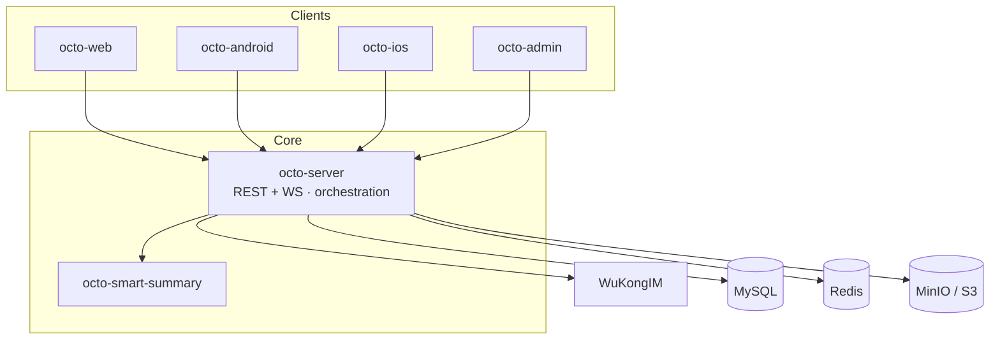

Octo is a set of focused services that meet at one anchor: **`octo-server`**. It exposes REST +
WebSocket APIs to the clients, orchestrates business logic and Lobster (AI agent) scheduling,
and drives [WuKongIM](/concepts/messaging-and-im-core) for real-time messaging.

## Service map

Clients and sibling services **all speak to `octo-server`**; deploy and scale one backend and
everything else talks to it. Storage and IM are pluggable: MySQL-compatible migrations and
object-storage adapters ship in the box, and WuKongIM is driven over a thin control-plane
boundary so the IM core stays swappable.

## The request lifecycle

Every request through `octo-server` follows the same path:

<Steps>
  <Step title="Authenticate">
    Auth middleware resolves the credential — a Redis-cached token parser also resolves the
    caller's language and role. See [Security & auth](/concepts/security-and-auth).
  </Step>
  <Step title="Authorise">
    Space middleware enforces org-aware RBAC (member / admin / owner), per-channel ACL, and
    agent-identity gating. Handlers that touch user data must pass through it.
  </Step>
  <Step title="Execute">
    Business logic runs — possibly spawning or resuming a Lobster (bot) session. See
    [The Lobster model](/concepts/the-lobster-model).
  </Step>
  <Step title="Fan out">
    The message is enqueued to WuKongIM (over gRPC); if a channel requires an external bridge,
    the relevant [adapter / channel](/guides/bot-developers/choose-a-channel) is triggered.
  </Step>
  <Step title="Respond">
    A unified JSON envelope (or WebSocket frame) is returned, with tracing and metrics tags,
    and rate-limited across three layers (per-IP, per-endpoint, per-UID).
  </Step>
</Steps>

## How the server is built

`octo-server` is organized as **27+ auto-registered modules** under `modules/` (each wires
itself in via `init()` + `register.AddModule()`) rather than one monolith. Bot identity,
on-behalf-of orchestration, spaces, threads, and BotFather each live in their own module.

<Card title="Deploy the whole thing" icon="rocket" href="/get-started/quickstart-deploy">
  See every service running together in one Compose stack.
</Card>
