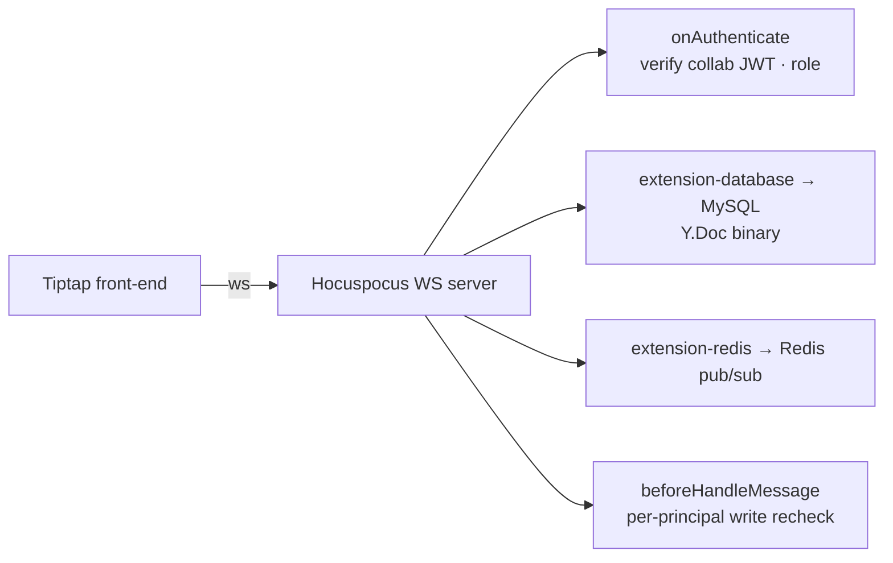

Octo Docs has two complementary surfaces: **real-time collaborative documents** backed by CRDTs,
and **interactive HTML documents** published from a prompt. They serve different jobs — live
co-editing vs. immutable, shareable artifacts.

## Real-time editing — `octo-docs-backend`

The collaborative-document subsystem is a focused, stateful **CRDT real-time sync service**
built on **Hocuspocus + Yjs**. A Tiptap front-end connects over WebSocket; the server owns
authoritative persistence and authorization.

Key properties:

- **CRDT sync** — Yjs documents merge concurrent edits without conflicts.
- **Authoritative persistence** — the binary `Y.Doc` is stored in MySQL; the server, not the
  client, is the source of truth.
- **Document-autonomous authorization** — access is governed per-document (`doc_member` + owner),
  with short-lived collab-token issuance and link invites; writes are re-checked per principal on
  each message.
- **Agent path** — a no-DOM conversion path lets Lobster agents read and edit documents without
  a browser.

<Note>
  This subsystem is scoped tightly to real-time document sync — it intentionally does not cover
  whiteboard/Excalidraw features. Authorization is per-document, independent of channel ACLs.
</Note>

## Interactive HTML docs — `octo-docs-html`

For artifacts rather than live editing, **`octo-docs-html`** turns a prompt into a self-contained
**interactive HTML document** — models, SVG diagrams, simulations, explainers, RFCs — published
at a stable URL. It's Octo-integrated, with:

- **Creator-owned access** — the author controls who can view.
- **Anchored inline commenting** — reviewers leave comments anchored to the text *or* the
  artifact they're looking at; comments re-anchor across versions.
- **Immutable versioning** — every publish is a new immutable version.

The HTML docs API is part of the generated reference — see the
[Docs (interactive HTML) API](/reference/api/html) and its
[CLI commands](/reference/cli/html).

<Card title="Use docs day-to-day" icon="messages-square" href="/guides/teams/use-chat-docs-tasks">
  How chat, docs, and tasks fit together for a team.
</Card>
