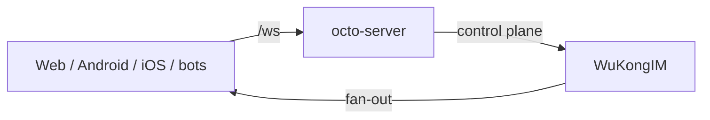

Octo's real-time messaging runs on **[WuKongIM](https://github.com/Mininglamp-OSS/octo-im)**
(`octo-im`) — a high-performance, decentralized instant-messaging server. `octo-server` drives
it over a thin control-plane boundary, so the IM core stays swappable while the platform owns
business logic and Lobster orchestration.

## Where it sits

Browser and SPA chat traffic flows through nginx `/ws`; `octo-server` authenticates and
authorizes, then enqueues messages to WuKongIM, which handles connection management and
delivery on a **channel-based publish/subscribe** model (personal, group, customer-service,
and community channels).

## Protocol

- A **custom binary protocol** (heartbeat packets are a single byte) for efficiency, plus a
  **JSON protocol available over WebSocket**.
- Transports: WebSocket, TLS 1.3, and proxy-protocol support.
- Channel types map onto Octo's conversation kinds (DM = `channel_type` 1, group = 2,
  thread = 5 — the same values you pass to the [Messages API](/reference/api/message)).

## Distributed by design

WuKongIM is built to run as a resilient cluster with **no single point of failure**:

- **Storage** — a self-developed distributed database on top of the PebbleDB key-value store.
  No third-party middleware dependency.
- **Clustering** — a modified *pull-mode* multi-group Raft, with decentralized design,
  inter-node data redundancy, and automatic failover.
- **Scaling** — fast automatic cluster expansion and a proxy-node mechanism.

<Info>
  Because there's no external message broker, a single-node deployment is genuinely
  self-contained — one of the reasons the [Compose stack](/guides/operators/deploy-compose)
  runs on one host. For production clustering, scale WuKongIM independently of `octo-server`.
</Info>

## Operations surfaces

WuKongIM integrates Webhook, a Datasource hook, and **Prometheus** monitoring. The manager API
(default admin port `5300` upstream; mapped to loopback in the Octo deployment) is an
admin/debug surface, not a chat transport — keep it off the public network. See
[Scale and observe](/guides/operators/scale-and-observe).

<Note>
  Requires Go 1.20+ to build; Windows is not supported. The repo ships helper binaries under
  `cmd/`: `wukongim` (server), `wkbench` (benchmark), and `wkdb` (node-local read-only storage
  inspector).
</Note>

<CardGroup cols={3}>
  <Card title="Architecture overview" icon="sitemap" href="/concepts/architecture-overview">
    Where the IM core sits in the whole platform.
  </Card>
  <Card title="Scale & observe" icon="chart-line" href="/guides/operators/scale-and-observe">
    Cluster, monitor, and scale WuKongIM.
  </Card>
  <Card title="Messages API" icon="comments" href="/reference/api/message">
    The wire-level messaging operations.
  </Card>
</CardGroup>
