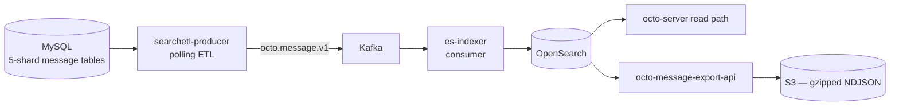

Message search is an **opt-in** pipeline that sits alongside the core stack. It has a clear
split: a *write/index* layer that keeps OpenSearch in sync with the message store, and a
*read/export* API for pulling large batches out.

## The pipeline

## Write / index — `octo-search-indexer`

One image ships **two decoupled binaries**:

- **`searchetl-producer`** (write side) — a standalone polling ETL that reads the MySQL message
  shard tables on a slow-cursor tick, enriches each row into the message contract with
  fail-closed visibility, and produces to Kafka.
- **`es-indexer`** (index side) — a Kafka consumer that idempotently bulk-writes into OpenSearch
  (`doc _id = message_id`), with Chinese tokenization handled by the index analyzer.

They never import each other; they meet only at the `octo-lib` `contract/searchmsg` message
contract and the Kafka topics (`octo.message.v1` + its DLQ).

<Info>
  **Reliability** — manual commit only; the offset advances only to the contiguous success
  prefix. Transient failures retry in place; permanent poison pills (4xx except 429, unknown
  schema version) route to the DLQ. Revoked / deleted messages are filtered at *read* time via a
  MySQL join in `octo-server`, not in the index — so a delete is always honored.
</Info>

A separate one-shot `cmd/backfill` loads history directly (bypassing Kafka), gated by a mandatory
field-level reconciliation.

## Read / export — `octo-message-export-api`

An **async batch** API over the OpenSearch index — there is no synchronous path:

<Steps>
  <Step title="Submit">
    `POST /v1/messages/batch` with a channel list + time range → always **HTTP 202** + a `task_id`.
  </Step>
  <Step title="Poll">
    `GET /v1/messages/batch/{task_id}` for status. `DELETE` cancels idempotently.
  </Step>
  <Step title="Download">
    Fetch gzipped **NDJSON** parts via presigned S3-compatible URLs.
  </Step>
</Steps>

Paging uses OpenSearch **PIT + `search_after`** (5-minute keep-alive) for a stable snapshot. The
result writer streams NDJSON through gzip, rolling a new part at ≥ 500 MB decompressed or
≥ 30 000 rows. Task/part metadata live in MySQL; payloads in S3; the service is otherwise
stateless. Server protection: `413` above 300 000 hits per task, `503` when the in-process cap
(50 tasks in v1) is exceeded.

## Enabling it

Search is off by default. Bring the infra up with `./setup.sh --search`, then run the
zero-downtime cutover — see [Operate search, summary & speech](/guides/operators/subsystems).

<Card title="Export messages, step by step" icon="magnifying-glass" href="/guides/integrators/export-and-search-messages">
  The how-to guide for the export API.
</Card>
