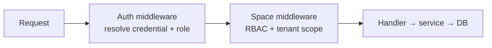

Octo has one authentication contract shared across every service, implemented by the
**[`octo-auth`](https://github.com/Mininglamp-OSS/octo-auth)** SDK (Go + TypeScript) and served
by `octo-server`. Any service that needs to verify a caller uses the same three realms.

## Three credential realms

| Realm | Credential | Verify endpoint | Scope |
|---|---|---|---|
| **Session** | 32-hex UUID (no prefix) | `POST /v1/auth/verify` | human web session |
| **User Bot** | `bf_…` | `POST /v1/auth/verify-bot` | DM + group + thread |
| **User API key** | `uk_…` (length ≥ 35) | `POST /v1/auth/verify-api-key` | bound to exactly one space |

A **`MultiVerifier`** facade dispatches by prefix: `uk_` → api-key, `bf_`/`app_` → bot,
anything else → session. `app_` (App Bot) is reserved — SDK v1 returns `AUTH_INVALID_CREDENTIAL`
for it.

<Info>
  Callers can request `?include=context` on `verify` / `verify-api-key` to get the principal's
  spaces and owned bots in one round trip. `verify-bot` does **not** accept it — a bot's
  `space_id` is server-authoritative, and middleware must ignore any client-sent `X-Space-Id`
  for bot traffic (anti-spoof).
</Info>

## RBAC and tenancy

Authorization is space-scoped. A space member has a role — `0` member / `1` admin / `2` owner —
and every handler that touches user data passes through **Space middleware**. Multi-tenant
isolation is structural: services filter by `space_id` (from `X-Space-ID`), the Bot API validates
bot ownership before any operation, and the thread module verifies parent-channel access.

## Anti-enumeration

Every "token bad" reason — missing, malformed, unknown, expired, disabled, kind mismatch —
collapses to a single wire outcome: **`AUTH_INVALID_CREDENTIAL` (401)**. The specific reason
lives only in the server's audit log; callers must not branch on any implied sub-reason. The SDK
preserves only the bucket.

## Typed errors

`octo-auth` maps four wire codes to typed, `errors.Is`-comparable kinds (Go) / `OctoAuthError`
(TS), and ships a **fail-closed** default error mapper:

| SDK kind | Wire code | HTTP |
|---|---|---|
| `ErrKindInvalidCredential` | `AUTH_INVALID_CREDENTIAL` | 401 |
| `ErrKindDisabled` | `AUTH_DISABLED` | 403 |
| `ErrKindForbidden` | `AUTH_FORBIDDEN` | 403 |
| `ErrKindInfraFailure` | `AUTH_INFRA_FAILURE` | 503 |

## Defense in depth

- **Rate limiting** — three layers in `octo-server` middleware: per-IP global, strict
  per-endpoint, and shared per-UID.
- **Secrets at rest** — the deployment keeps `.env` at `root:600`; `OCTO_MASTER_KEY` provides
  AEAD at-rest encryption (rotation is destructive — pick once). See
  [Security hardening](/guides/operators/security-hardening).

<CardGroup cols={2}>
  <Card title="Verify credentials in your service" icon="key" href="/guides/integrators/verify-credentials-with-octo-auth">
    Use the octo-auth SDK with your own middleware.
  </Card>
  <Card title="Error taxonomy" icon="triangle-exclamation" href="/reference/errors-and-envelopes">
    The generated wire error reference.
  </Card>
</CardGroup>
