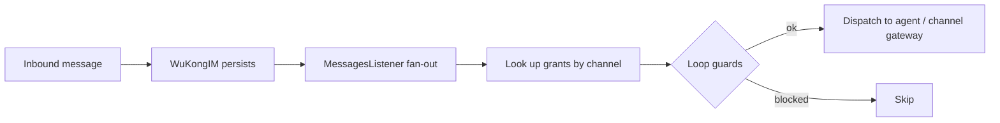

An **Agent** (智能体) is an AI participant that acts as a first-class member of a conversation —
carrying the *thinking* and *doing* while people keep *taste*. This page explains how that is
actually implemented in `octo-server`.

<Info>
  "Agent" is the product concept. In the code these are the **`robot`/bot** identity and the
  **on-behalf-of (OBO)** framework — agents are first-class conversation participants, not a
  bolt-on chatbot layer. You'll still see the literal `bf_`/`app_` tokens and the `bot` API domain.
</Info>

## Kinds of agent

Agents authenticate by token prefix and are routed by a unified `authBot()` middleware:

| Kind | Token | Access |
|---|---|---|
| **Assistant** (助理) | `bf_…` | DM + group + thread (requires membership) |
| **Intelligent Application** (智能应用) | `app_…` | DM-only (server-enforced) |

An **Expert** (专家) is a specialized Agent — an Assistant curated for a particular domain or task
(its own instructions, skills, and tools). Experts are a product-level specialization rather than a
distinct credential kind: on the wire an Expert is an Assistant (`bf_…`).

Creating an Assistant, its command menu, and its skills are handled by the **BotFather** module —
the same `/newbot` flow you use in [Connect your first agent](/get-started/quickstart-connect-a-bot).

## How a message reaches an agent

Agents don't poll. A **fan-out hook** fires after WuKongIM persists an inbound message but
*before* the copy is delivered:

Grants are pulled by `(channel_id, channel_type)`, then three **loop-protection** rules gate
dispatch: an agent never processes its own send, never re-fires on the grantor's own outbound, and
an already-processed marker (`__obo_processed__`, a reserved server-only namespace) prevents
double-handling.

## On-behalf-of (Persona Clone)

OBO lets an agent act **as a user persona** with an explicit grant. The REST endpoints mount under
`/v1/obo` behind user auth, and the acting user must be the grantor — cross-user access returns
`404` as an enumeration defense. This is how an agent can operate inside a conversation on your
behalf without ever holding your session.

## Tool calls surface as cards

When an agent takes an action, the result surfaces through the **Interactive Card protocol**
(Adaptive Cards 1.5, the `octo/v1` profile) so tool-call previews and actions render natively in
the client — the "inline tool-call preview" you see in [octo-web](/guides/teams/use-chat-and-docs).

## Agent tokens stay server-side

An agent token never leaves `octo-server`. A browser only ever sees a `bot_uid`; a local agent
runtime fetches the token it needs through its own scoped credential, so the secret is never
exposed to the client. Which daemons are alive and which agents they host is tracked server-side
and surfaced through the [agent-runtime upgrade flow](/guides/operators/upgrades).

<Card title="Put an agent into Octo" icon="robot" href="/get-started/quickstart-connect-a-bot">
  The hands-on path: register an Assistant and bridge Claude Code in minutes.
</Card>
