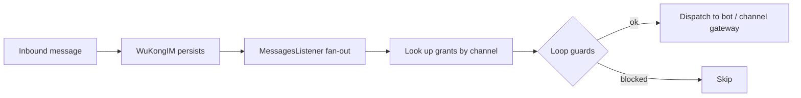

A **Lobster** is Octo's name for an OpenClaw-powered digital double — an AI agent that carries
the *thinking* and *doing* while humans keep *taste*. This page explains how that idea is
actually implemented in `octo-server`.

<Info>
  "Lobster" is the product concept. In the code, it's the **bot** and **on-behalf-of (OBO)**
  framework — bots are first-class conversation participants, not a bolt-on chatbot layer.
</Info>

## Two kinds of bot

Bots authenticate by token prefix and are routed by a unified `authBot()` middleware:

| Kind | Token | Access |
|---|---|---|
| **User Bot** | `bf_…` | DM + group + thread (requires membership) |
| **App Bot** | `app_…` | DM-only (server-enforced) |

Creating a bot, its command menu, and its skills are handled by the **BotFather** module — the
same `/newbot` flow you use in [Connect your first bot](/get-started/quickstart-connect-a-bot).

## How a message reaches an agent

Agents don't poll. A **fan-out hook** fires after WuKongIM persists an inbound message but
*before* the copy is delivered:

Grants are pulled by `(channel_id, channel_type)`, then three **loop-protection** rules gate
dispatch: a bot never processes its own send, never re-fires on the grantor's own outbound, and
an already-processed marker (`__obo_processed__`, a reserved server-only namespace) prevents
double-handling.

## On-behalf-of (Persona Clone)

OBO lets a bot act **as a user persona** with an explicit grant. The REST endpoints mount under
`/v1/obo` behind user auth, and the acting user must be the grantor — cross-user access returns
`404` as an enumeration defense. This is how a Lobster can operate inside a conversation on your
behalf without ever holding your session.

## Tool calls surface as cards

When an agent takes an action, the result surfaces through the **Interactive Card protocol**
(Adaptive Cards 1.5, the `octo/v1` profile) so tool-call previews and actions render natively in
the client — the "inline tool-call preview" you see in [octo-web](/guides/teams/use-chat-docs-tasks).

## Where the fleet lives

Which daemons are alive, which bots they host, and which provider runtimes (Claude Code, Codex,
OpenClaw, Hermes) run where is owned by **[`octo-fleet`](/ecosystem/repository-guide)** — split
out of `octo-server` so the IM core sheds agent-fleet concerns. A bot token never leaves the
server; a browser sees only a `bot_uid`, and a daemon fetches the token with its scoped JWT.

<Card title="Put an agent into Octo" icon="robot" href="/get-started/quickstart-connect-a-bot">
  The hands-on path: register a bot and bridge Claude Code in minutes.
</Card>
