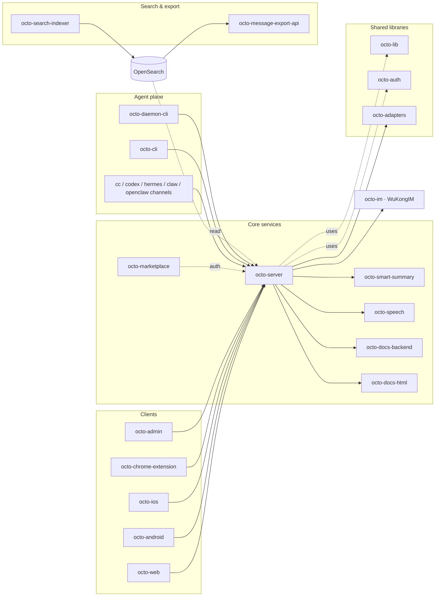

Octo is spread across a family of focused repositories under
[Mininglamp-OSS](https://github.com/Mininglamp-OSS). This portal is organized by *what you want
to do*; this page is the map by *repo*, for contributors and anyone orienting themselves.

## How the pieces fit

## Core services (Go)

| Repo | Role | Docs |
|---|---|---|
| [`octo-server`](https://github.com/Mininglamp-OSS/octo-server) | Backend API · orchestration · Lobster scheduling · drives WuKongIM | [Read →](/concepts/architecture-overview) |
| [`octo-smart-summary`](https://github.com/Mininglamp-OSS/octo-smart-summary) | LLM conversation summarization | [Read →](/guides/operators/subsystems) |
| [`octo-speech`](https://github.com/Mininglamp-OSS/octo-speech) | Speech-to-text microservice | [Read →](/guides/operators/subsystems) |
| [`octo-search-indexer`](https://github.com/Mininglamp-OSS/octo-search-indexer) | Message search write + index layer | [Read →](/concepts/search-and-export-pipeline) |
| [`octo-message-export-api`](https://github.com/Mininglamp-OSS/octo-message-export-api) | Async batch message export | [Read →](/guides/integrators/export-and-search-messages) |
| [`octo-marketplace`](https://github.com/Mininglamp-OSS/octo-marketplace) | Skill / MCP marketplace control plane (scaffold) | [Read →](/guides/integrators/marketplace) |

## Collaborative docs (Go)

| Repo | Role | Docs |
|---|---|---|
| [`octo-docs-backend`](https://github.com/Mininglamp-OSS/octo-docs-backend) | Real-time CRDT doc sync (Yjs + Hocuspocus) | [Read →](/concepts/collaborative-docs) |
| [`octo-docs-html`](https://github.com/Mininglamp-OSS/octo-docs-html) | Prompt-native interactive HTML documents | [Read →](/concepts/collaborative-docs) |

## Clients

| Repo | Language | Role | Docs |
|---|---|---|---|
| [`octo-web`](https://github.com/Mininglamp-OSS/octo-web) | TS / React | Web & PC (Electron) client | [Read →](/guides/teams/clients) |
| [`octo-android`](https://github.com/Mininglamp-OSS/octo-android) | Kotlin / Java | Native Android client | [Read →](/guides/teams/clients) |
| [`octo-ios`](https://github.com/Mininglamp-OSS/octo-ios) | Swift / Obj-C | Native iOS client | [Read →](/guides/teams/clients) |
| [`octo-chrome-extension`](https://github.com/Mininglamp-OSS/octo-chrome-extension) | TS / React (WXT) | Browser extension | [Read →](/guides/teams/clients) |
| [`octo-admin`](https://github.com/Mininglamp-OSS/octo-admin) | TS / React | Admin console | [Read →](/guides/teams/admin-console) |

## IM core, shared libs & CLI

| Repo | Role | Docs |
|---|---|---|
| [`octo-im`](https://github.com/Mininglamp-OSS/octo-im) | WuKongIM — distributed messaging core | [Read →](/concepts/messaging-and-im-core) |
| [`octo-lib`](https://github.com/Mininglamp-OSS/octo-lib) | Shared Go library (protocol, crypto, storage, HTTP) | [Read →](/reference/sdks) |
| [`octo-auth`](https://github.com/Mininglamp-OSS/octo-auth) | Credential verifier SDK (Go + TS) | [Read →](/guides/integrators/verify-credentials-with-octo-auth) |
| [`octo-adapters`](https://github.com/Mininglamp-OSS/octo-adapters) | Third-party IM / AI / data-source bridges | [Read →](/guides/integrators/write-an-adapter) |
| [`octo-cli`](https://github.com/Mininglamp-OSS/octo-cli) | Single-binary REST client for AI bots | [Read →](/reference/octo-cli) |
| [`octo-daemon-cli`](https://github.com/Mininglamp-OSS/octo-daemon-cli) | Per-machine runtime monitor & upgrader | [Read →](/guides/operators/upgrades) |

## Standards, skills & channels

| Repo | Role | Docs |
|---|---|---|
| [`octo-spec`](https://github.com/Mininglamp-OSS/octo-spec) | Git-native AI-coding standard (OKF format) | [Read →](/reference/octo-spec-okf) |
| [`octo-skills`](https://github.com/Mininglamp-OSS/octo-skills) | AgentSkills collection | [Read →](/guides/bot-developers/publish-a-skill) |
| [`cc-channel-octo`](https://github.com/Mininglamp-OSS/cc-channel-octo) | Claude Code → Octo channel | [Read →](/guides/bot-developers/claude-code-channel) |
| [`codex-channel-octo`](https://github.com/Mininglamp-OSS/codex-channel-octo) | OpenAI Codex → Octo channel | [Read →](/guides/bot-developers/codex-channel) |
| [`hermes-channel-octo`](https://github.com/Mininglamp-OSS/hermes-channel-octo) | hermes-agent → Octo channel | [Read →](/guides/bot-developers/hermes-channel) |
| [`claw-channel-octo`](https://github.com/Mininglamp-OSS/claw-channel-octo) | WorkBuddy Claw → Octo channel | [Read →](/guides/bot-developers/openclaw-and-claw-channels) |
| [`openclaw-channel-octo`](https://github.com/Mininglamp-OSS/openclaw-channel-octo) | OpenClaw → Octo channel | [Read →](/guides/bot-developers/openclaw-and-claw-channels) |

## Delivery

| Repo | Role | Docs |
|---|---|---|
| [`octo-deployment`](https://github.com/Mininglamp-OSS/octo-deployment) | Official OOTB deployment (Compose + Kubernetes + Helm) | [Read →](/guides/operators/deploy-compose) |
| [`octo-website`](https://github.com/Mininglamp-OSS/octo-website) | Official landing page | — |

<Info>
  Each repo keeps its own deep docs; this portal aggregates the cross-cutting narrative and the
  [generated reference](/reference/rest-websocket-api). Every repo ships under **Apache-2.0**
  ([release-as-product](/concepts/design-philosophy)).
</Info>
