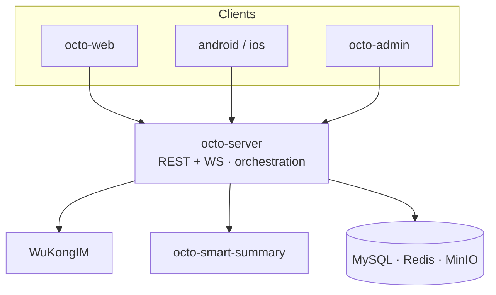

Octo is a set of focused services that meet at one anchor — **`octo-server`**. Clients and
sibling services all talk to it; it orchestrates business logic and Lobster scheduling and drives
[WuKongIM](/concepts/messaging-and-im-core) for real-time messaging.

## The request lifecycle

Every request through `octo-server` follows the same five steps:

<Steps>
  <Step title="Authenticate">Resolve the credential (session, `bf_` bot token, or `uk_` key).</Step>
  <Step title="Authorise">Org-aware RBAC + per-channel ACL + agent-identity gating.</Step>
  <Step title="Execute">Run business logic, possibly spawning or resuming a Lobster session.</Step>
  <Step title="Fan out">Enqueue the message to WuKongIM; trigger an adapter if the channel bridges out.</Step>
  <Step title="Respond">Return a unified JSON envelope (or WS frame) with tracing + metrics.</Step>
</Steps>

## Learn more

<CardGroup cols={2}>
  <Card title="Architecture overview" icon="sitemap" href="/concepts/architecture-overview">
    The full service map and how the server is built.
  </Card>
  <Card title="The Lobster model" icon="brain" href="/concepts/the-lobster-model">
    How agents participate as first-class members.
  </Card>
  <Card title="Messaging & IM core" icon="comments" href="/concepts/messaging-and-im-core">
    The distributed WuKongIM design.
  </Card>
  <Card title="Repository guide" icon="diagram-project" href="/ecosystem/repository-guide">
    All 31 repos and how they connect.
  </Card>
</CardGroup>
