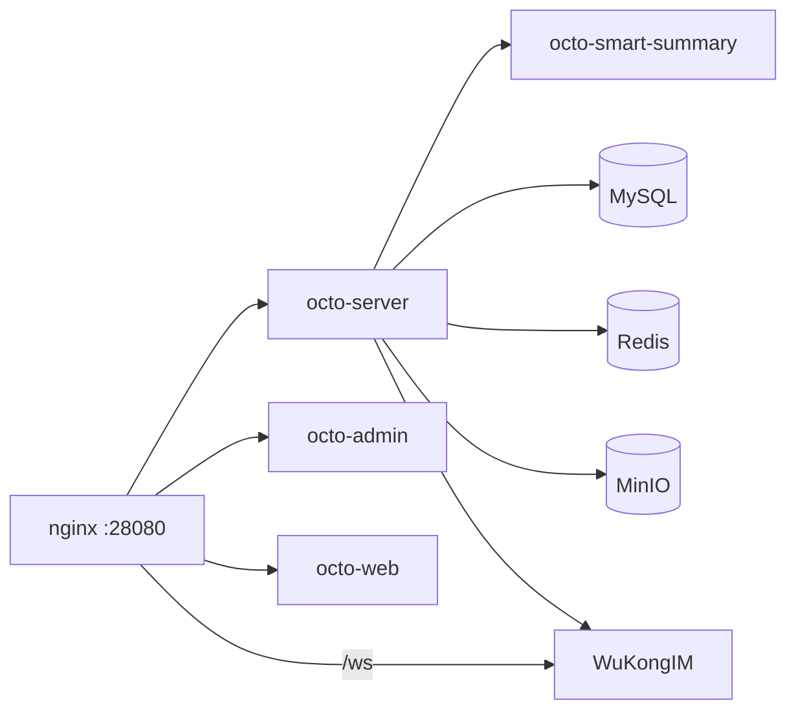

This tutorial takes you from nothing to a running Octo stack on a single host, using the
**official out-of-the-box Docker Compose deployment**
([`octo-deployment`](https://github.com/Mininglamp-OSS/octo-deployment)). By the end you'll
have the server, admin console, web client, WuKongIM messaging core, MySQL, Redis, and MinIO
object storage all wired together and verified.

<Tip>
  One command brings up the whole stack behind an nginx reverse proxy on a single port
  (`28080`). Everything else stays on loopback by default — a safe posture for evaluation
  and internal demos.
</Tip>

## Prerequisites

<Info>
  Make sure your host has everything below before you start.
</Info>

- **Linux or macOS** with `bash` ≥ 4 and `openssl`.
- **Docker** running, with the Compose v2 plugin (`docker compose`) or the standalone
  `docker-compose` binary on your `PATH`. Verify:
  ```bash
  docker info            # should succeed without sudo
  docker compose version
  ```
- **≥ 4 GiB RAM** and **≥ 10 GiB free disk** for the named volumes.
- **One open TCP port** for client traffic: `28080`.
- **Outbound access** to `docker.io` (or a mirror) to pull the `mininglamposs/*`, `mysql:8`,
  `redis:7-alpine`, `minio/minio`, `wukongim/wukongim`, and `nginx:1.27-alpine` images.

<Warning>
  **Already running Octo on this host?** Set a unique `COMPOSE_PROJECT_NAME` **before** you
  bring the stack up — two default clones share named volumes, and a `docker compose down -v`
  from one can wipe the other's data.
</Warning>

## Deploy the stack

<Steps>
  <Step title="Clone and generate config">
    ```bash
    git clone https://github.com/Mininglamp-OSS/octo-deployment.git
    cd octo-deployment
    ./setup.sh
    ```

    `setup.sh` runs interactively and writes `docker/.env` with freshly rotated random secrets
    and a generated admin password. It auto-detects your public IP but **defaults to
    `localhost`** — press Enter to keep the stack local, or type a real DNS name / IP if
    clients elsewhere need to reach it.

    <Note>
      For scripted setups, skip the prompts: `./setup.sh --non-interactive --ip 1.2.3.4`.
      Add `--summary` for the optional LLM summary services, or `--search` for the
      message-search pipeline.
    </Note>
  </Step>

  <Step title="Bring the stack up">
    ```bash
    sudo ./setup.sh --up
    ```

    `--up` is a start-only subcommand: it runs `docker compose up -d --wait` and **blocks until
    every service reports `(healthy)`** and both one-shot init jobs (`preflight`, `minio-init`)
    exit cleanly. It prints a `.` every 5 seconds while waiting — a cold MySQL init can take
    60–90 s on first boot. If a service fails, `--up` prints `docker compose ps`, names the
    failing services, and gives you a `logs` hint before exiting.

    <Info>
      **Why sudo?** `--up` needs the Docker daemon socket, and `docker/.env` holds every
      high-value secret (MySQL / MinIO / admin / master-key), so it stays `root:600`. `--up`
      never regenerates those secrets — it only starts the stack.
    </Info>
  </Step>

  <Step title="Verify the deployment">
    Run the built-in smoke test, which exercises the **external** surface end-to-end — not just
    container health:

    ```bash
    sudo ./setup.sh --smoke-test
    ```

    It runs 11 probes across two failure domains and prints PASS/FAIL for each:

    - **`[infra]`** — container health, nginx routing, `octo-server` REST, MinIO
      health, and the admin / web SPAs.
    - **`[user-path]`** — WuKongIM `/ws`, an admin login (POST), presigned-URL issuance (GET),
      and a signed 1-byte PUT into MinIO.

    All-PASS means auth and object storage genuinely work, not just that the containers are up.
  </Step>

  <Step title="Log in">
    `setup.sh` prints the admin URL and password at the end of the run. With the default
    `localhost`:

    | Surface | URL | Login |
    |---|---|---|
    | **Admin console** | `http://localhost:28080/admin/` | user `superAdmin` |
    | **Web client** | `http://localhost:28080/` | — |

    Open the admin console, log in as `superAdmin` with the printed password, and create your
    first organization.

    <Note>
      If you set `OCTO_DOMAIN` to a real hostname, make sure that name resolves on every machine
      that hits the UI (real DNS or an `/etc/hosts` entry).
    </Note>
  </Step>
</Steps>

## What's running

The Compose stack ties together:



All client traffic enters through nginx on `28080`; every backing service (MySQL, Redis,
MinIO, the WuKongIM manager API) is bound to loopback.

## Next steps

<CardGroup cols={2}>
  <Card title="Connect your first AI bot" icon="robot" href="/get-started/quickstart-connect-a-bot">
    The signature Octo path: bridge Claude Code into your new instance.
  </Card>
  <Card title="Onboard your organization" icon="users" href="/guides/teams/onboard-your-org">
    Invite members and set up channels.
  </Card>
  <Card title="Deploy on Kubernetes" icon="dharmachakra" href="/guides/operators/deploy-kubernetes">
    When you outgrow a single host.
  </Card>
  <Card title="Configuration reference" icon="sliders" href="/reference/configuration">
    Every server config key and default.
  </Card>
</CardGroup>

<Tip>
  To remove the stack (interactive): `sudo ./setup.sh --uninstall`.
</Tip>
