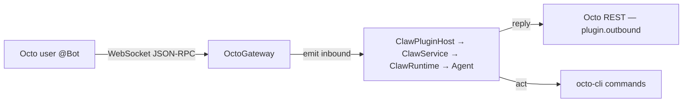

Two channels wrap the OpenClaw family. Both connect over WebSocket and let the agent act on Octo.

## openclaw-channel-octo

**[`openclaw-channel-octo`](https://github.com/Mininglamp-OSS/openclaw-channel-octo)** is the
OpenClaw channel plugin, published exclusively on ClawHub.

```bash
openclaw plugins install clawhub:octo
openclaw channels add --channel octo \
  --account my_bot \
  --bot-token bf_your_token_here \
  --http-url https://your-server.example/api
openclaw gateway run --force
```

Requires Node ≥ 22 and OpenClaw ≥ 2026.4.15. Account config lives in `~/.openclaw/openclaw.json`
under `channels.octo.accounts` and hot-reloads. Tokens can be `bf_` (Assistant, full group +
thread) or `app_` (Intelligent Application, DM-only).

<Info>
  The plugin registers one agent tool, **`octo_management`** (groups, `GROUP.md`/`THREAD.md`,
  threads, members, `write-secret`). It's only admitted under `tools.profile: full`; fresh
  installs default to the `coding` profile, so add it via `tools.alsoAllow`.
</Info>

Lifecycle: REST-register the Assistant → WebSocket connect → auto-reconnect → greet the owner →
dispatch, with typing indicators, read receipts, and progress / display cards.

## claw-channel-octo

**[`claw-channel-octo`](https://github.com/Mininglamp-OSS/claw-channel-octo)** is the built-in
WorkBuddy Claw channel plugin — it makes Octo IM a WorkBuddy remote-control channel, peer to
WeCom / Feishu / DingTalk. It's a dual-system design:



- **OctoGateway** (the "ears") — a persistent WebSocket (JSON-RPC over WS) that receives inbound
  messages and emits them to the Claw runtime.
- **octo-cli** (the "hands") — the agent actively operates Octo via
  [`octo-cli`](/guides/bot-developers/drive-octo-with-cli) commands.

With `connectionMode: "websocket"`, replies go straight through `plugin.outbound` / Octo REST —
not through an external webhook relay. Features: DM / group / thread, text / image / file, file
upload, streaming replies (send → edit → final), auto-reconnect, 30 s heartbeat, and 5-minute
dedup. Phases 1–2 are complete; the settings-panel UI (Phase 3) is pending.

<Card title="Compare all channels" icon="code-compare" href="/guides/bot-developers/choose-a-channel">
  See where OpenClaw and Claw sit relative to the other channels.
</Card>
