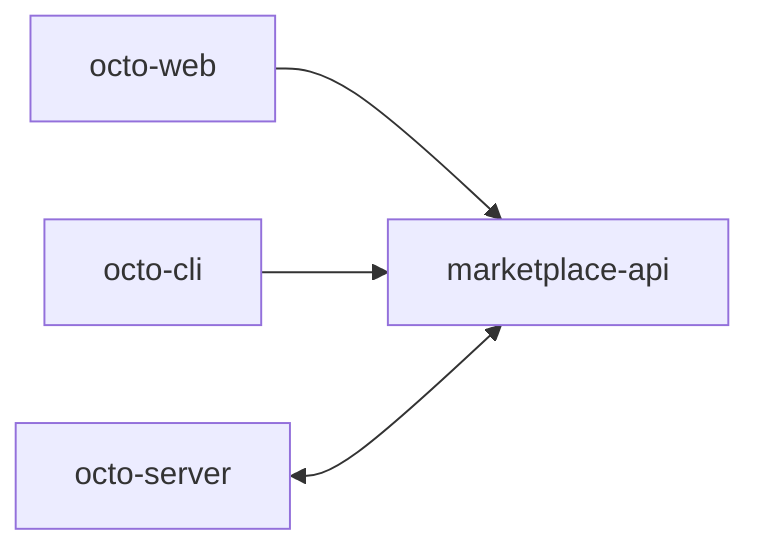

**[`octo-marketplace`](https://github.com/Mininglamp-OSS/octo-marketplace)** is the control plane
for the future Octo **Skill and MCP marketplace** — a place to publish, version, and distribute
[Skills](/guides/bot-developers/publish-a-skill) and MCP servers.

<Warning>
  **Scaffold status.** The service is an early Go scaffold. The control-plane *shape* is in place
  — health/readiness, config, Octo auth client, Skill CRUD/upload/parsing, and Local/OSS
  downloads — but catalog, publishing, versioning, MCP business APIs, and persistence are
  **deferred**. Treat this page as a preview of where publishing will live.
</Warning>

## Where it sits



Ownership is split cleanly:

- **`octo-server`** owns identity (it authenticates users and `bf_` bots).
- **`octo-marketplace`** owns assets, releases, and policy.
- **`octo-cli`** owns local install on the consumer side.

## Run the scaffold

```bash
go run ./cmd/marketplace-api      # port 8092
# or
docker compose up --build         # MySQL on 3306
```

It uses Go 1.25 + Gin + MySQL, and follows the API-service shape of
[`octo-smart-summary`](/ecosystem/repository-guide). Auth is unified user + `bf_` User Bot,
fails closed (`AUTH_ENABLED` defaults true), via the Octo auth client. When mounted behind the
web gateway it serves under `/market/api/v1`.

<Card title="Author a Skill today" icon="puzzle" href="/guides/bot-developers/publish-a-skill">
  Skills work now via the git-native install path — the marketplace will add discovery on top.
</Card>
