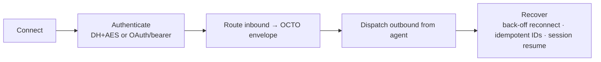

An **adapter** bridges an external system — a chat stack, an AI provider, a data source — into
Octo so it becomes a agent-addressable surface. Adapters live in
**[`octo-adapters`](https://github.com/Mininglamp-OSS/octo-adapters)**. Each one is
self-contained, can be enabled/disabled independently, and is loaded at boot from
`octo-server`'s config — **plug, don't patch**; you never fork the core.

<Info>
  A [channel](/guides/bot-developers/choose-a-channel) is a specialized adapter that wraps an
  *agent runtime*. If you're bringing a coding agent into Octo, start with a channel. Write an
  adapter when you're bridging a new *external system* or protocol.
</Info>

## The one lifecycle every adapter implements



Every adapter exposes the **same OCTO-internal envelope** — channel id + message + agent context
— regardless of the external protocol it speaks. That uniformity is what lets `octo-server`
route to any adapter identically.

## Polyglot by design

Adapters run in **TypeScript (Node)** and **Python** side by side. The repo ships three
reference families you can copy:

| Adapter | Language | Highlights |
|---|---|---|
| Claude Agent SDK gateway | TypeScript | WS gateway, DH key exchange, AES-CBC framing, streaming, DM + group, session persistence |
| OpenClaw channel | TypeScript | OCTO IM WS, streaming, typing, read receipts, multi-account |
| Hermes Agent channel | Python | hermes-agent bridge |

## Run one locally

```bash
# Node adapter
pnpm --filter <adapter> dev

# Python adapter
pip install -e . && python -m <module>.cli
```

Register it in `octo-server`'s adapter config to have it loaded at boot. Shared primitives
(protocol, crypto, storage, HTTP helpers) come from
[`octo-lib`](/ecosystem/repository-guide), so adapters stay thin.

<Card title="Verify inbound credentials" icon="key" href="/guides/integrators/verify-credentials-with-octo-auth">
  Use octo-auth in your adapter's Authenticate step.
</Card>
