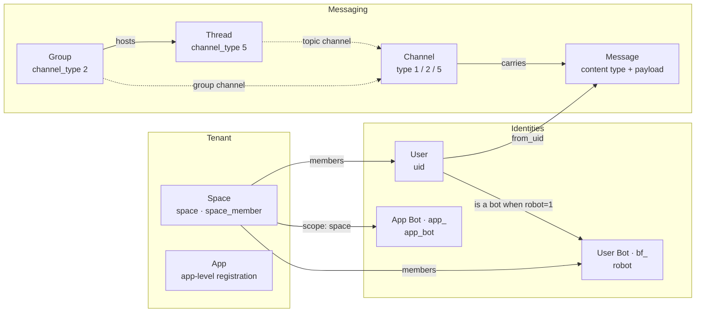

Octo's entities are owned by **[`octo-server`](https://github.com/Mininglamp-OSS/octo-server)** (Go
on top of [WuKongIM](/concepts/messaging-and-im-core)), with shared types and enums in
**[`octo-lib`](https://github.com/Mininglamp-OSS/octo-lib)**. Persisted records store to MySQL and
every table embeds a base model — `id`, `created_at`, `updated_at` (`octo-lib/pkg/db`). The
[octo-cli OpenAPI specs](/reference/rest-websocket-api) are the external contract and pin the
wire-level enum values used below.

<Info>
  This page consolidates the entity model that the [concept pages](/concepts/architecture-overview)
  describe in prose. Field and enum details track the cited source files; when in doubt, the source
  is authoritative.
</Info>

## Entity map

Bots are a specialization of users, not a separate identity plane. Channels are a WuKongIM concept
keyed by an id plus a `channel_type`; groups and threads project onto channel types 2 and 5.

## Space

The tenant boundary — it owns channels, members, and data. Defined in
`octo-server/modules/space/model.go` (`space` and `space_member` tables).

| Attribute | Meaning |
|---|---|
| `space_id` | Tenant identifier. |
| `name` · `description` · `logo` | Display metadata. |
| `creator` | `uid` of the owner who created the space. |
| `max_users` | Member cap (`0` = unlimited). |
| `join_mode` | How members join (see enum). |
| `status` | Lifecycle state (see enum). |

| Enum | Values |
|---|---|
| `join_mode` | `0` direct · `1` approval required |
| `status` | `0` disbanded · `1` normal · `2` banned |
| member `role` (`space_member`) | `0` member · `1` admin · `2` owner |

Members are recorded in `space_member` (`space_id` + `uid`, a `role`, and a `status` of `1` normal /
`0` removed). Email invitations and join applications are modeled alongside in the same module.

## User

The canonical identity. `uid` is the universal key referenced by space members, group members,
message senders, and bots. Defined in `octo-server/modules/user/db.go` (`user` table).

| Attribute | Meaning |
|---|---|
| `uid` | Universal identity key. |
| `name` · `username` · `email` · `phone` | Profile and login identifiers. |
| `category` | Account kind (see enum). |
| `status` | Enabled/disabled (see enum). |
| `role` | System role string (see enum). |
| `robot` | `1` when this user is a bot. |
| `is_destroy` | Account-destruction lifecycle (see enum). |
| `language` | Preferred UI language. |

| Enum | Values |
|---|---|
| `status` | `0` disabled · `1` enabled |
| `is_destroy` | `0` normal · `1` applying (cooling-off) · `2` destroyed |
| `category` | `customerService` · `system` |
| `role` | `admin` · `superAdmin` · `""` (normal user) |

Enum sources: `octo-server/modules/user/const.go` and `db.go`. The `role` column is the authoritative
system role for RBAC — see [Security & auth model](/concepts/security-and-auth).

## Bot — two kinds

A bot is a user (`robot=1`) fronted by one of two credential-bearing records. Identity resolution
routes by **token prefix** (`app_*` → App Bot, `bf_*` → User Bot) in
`octo-server/modules/botidentity`.

### User Bot (`bf_`)

The `robot` table (`octo-server/modules/robot` + `botfather`). Created and managed through
**BotFather** chat commands (`/newbot`, `/token`, `/revoke`). Can participate in **DM, group, and
thread** channels (with membership).

| Attribute | Meaning |
|---|---|
| `robot_id` · `username` | Bot identity (`username` ends in `_bot`). |
| `token` / `bot_token` | Credential (`bf_…`). |
| `creator_uid` | Owning user. |
| `bot_commands` | Declared command menu (JSON). |
| `access_mode` | `0` approval · `1` auto · `2` forbidden. |
| `agent_platform` · `agent_version` · `plugin_version` | Runtime it bridges. |

Long-lived user API keys (`uk_`) are issued alongside in the same module.

### App Bot (`app_`)

The `app_bot` table (`octo-server/modules/app_bot`). **DM-only** and requires a friend relationship.

| Attribute | Meaning |
|---|---|
| `uid` | App Bot identity (`app_…`). |
| `display_name` · `description` · `avatar` | Presentation. |
| `token` | Credential (`app_…`). |
| `scope` | `platform` (global) · `space` (single space). |
| `status` | `0` draft · `1` published · `2` unpublished. |
| `welcome_msg` | First-contact message. |

## Channel

A **WuKongIM-owned** logical entity — there is no monolithic channel row in octo-server. A channel is
an id plus a `channel_type`; per-channel options live in the `channel_setting` side-table
(`octo-server/modules/channel`). The full type enum is defined in `octo-lib/common/constant.go`:

| `channel_type` | Meaning |
|---|---|
| `0` | none |
| `1` | person (**DM**) |
| `2` | group |
| `3` | customer service |
| `4` | community |
| `5` | community topic (**thread**) |
| `6` | info |

<Note>
  The REST API contract uses the three types in active use — **`1` = DM, `2` = group, `5` = thread**
  (`octo-cli/internal/registry/specs/message.json`). DM channel ids are composite (`fromUID@toUID`).
</Note>

## Message

Stored in **sharded** tables (`message`, `message1..N`, chosen by a hash of the channel id) —
`octo-server/modules/message/db.go`. A message carries `from_uid`, `channel_id` + `channel_type`, a
`message_seq`, a timestamp, and an opaque `payload` whose JSON `type` field is the content type from
`octo-lib/common/msg.go`:

| Content type | Value |
|---|---|
| Text | `1` |
| Image | `2` |
| GIF | `3` |
| Voice | `4` |
| Video | `5` |
| Location | `6` |
| Card | `7` |
| File | `8` |
| Multiple forward | `11` |
| Vector sticker | `12` |
| Emoji sticker | `13` |
| Rich text | `14` |
| Invite to organization | `16` |
| CMD (command) | `99` |
| Tip | `2000` |

System notifications occupy a separate band — e.g. `FriendApply` `1000`, `GroupCreate` `1001`,
`GroupMemberAdd` `1002`, `RevokeMessage` `1006`, `GroupUpgrade` `1022`, and the thread-created notice
`1100`. Reactions, pins, reminders, and read-state are tracked in satellite tables in the same
module. See [Search & export pipeline](/concepts/search-and-export-pipeline) for how payloads are
indexed.

## Thread

A conversation topic under a group — `octo-server/modules/thread` (`thread` table). Its channel id is
composite (`groupNo` + `____` + `shortID`) and it maps to `channel_type=5`.

| Attribute | Meaning |
|---|---|
| `short_id` · `group_no` | Thread id and parent group. |
| `name` · `creator_uid` | Title and owner. |
| `source_message_id` | Message the thread was spun off from. |
| `status` | Lifecycle (see enum). |
| `message_count` · `last_message_at` | Activity summary. |
| `thread_md` | Optional collaborative notes (versioned). |

| Enum | Values |
|---|---|
| `status` | `1` active · `2` archived · `3` deleted |
| member `role` | `0` normal · `1` creator |

## Supporting entities

<AccordionGroup>
  <Accordion title="Group — octo-server/modules/group">
    Backs `channel_type=2` and hosts threads. Enums (`group/const.go`): status `0` disabled / `1`
    normal / `2` disband; member role `0` common / `1` creator / `2` manager; group type `0` common
    / `1` super (large group). Member `status` is `1` normal / `2` blacklist.
  </Accordion>
  <Accordion title="Integration & incoming webhook — octo-server/modules/integration, incomingwebhook">
    External connectors authenticate as OIDC principals with `uk_` API keys (`integration`), while
    inbound webhooks post as synthetic senders with an `iwh_` prefix (`incomingwebhook`). These are
    how outside systems send into channels without being full bots.
  </Accordion>
  <Accordion title="App — octo-server/modules/base/app">
    A low-level multi-tenant registration (`app_id`, `app_key`, `app_name`, `status`). It underpins
    app-scoped identity; the customer-facing tenant boundary is the **Space** above.
  </Accordion>
</AccordionGroup>

## Cross-cutting enums

### Credential prefixes

Every credential is recognizable by its prefix — the same set the
[octo-auth verifier](/reference/auth-verify-api) dispatches on:

| Prefix | Credential |
|---|---|
| `bf_` | User Bot token |
| `app_` | App Bot token |
| `uk_` | Long-lived user API key |
| `iwh_` | Incoming-webhook sender |

Full verification semantics are in [Security & auth model](/concepts/security-and-auth).

### Operation risk levels

Every REST operation is annotated with an `x-octo-risk` level in the OpenAPI spec, surfaced on each
[API domain page](/reference/rest-websocket-api):

| Risk | Meaning |
|---|---|
| `read` | Non-mutating. |
| `write` | Mutating. |
| `high-risk-write` | Destructive or wide-blast-radius; treat with extra care. |

## Not data entities

Two concepts you'll see across the docs are **not** persisted with a schema — don't look for a table:

<Columns cols={2}>
  <Card title="Skill" icon="puzzle-piece" href="/guides/bot-developers/publish-a-skill">
    A packaged Markdown capability (a `SKILL.md` directory) loaded by agents — it lives in repos like
    `openclaw-channel-octo` and `octo-skills`, not a database.
  </Card>
  <Card title="Adapter" icon="plug" href="/guides/integrators/write-an-adapter">
    A runtime bridge/proxy (and client-side plugin) — behavior, not a stored record. Connectors that
    *do* persist state are the integration and webhook models above.
  </Card>
</Columns>

## Next steps

<CardGroup cols={3}>
  <Card title="Security & auth model" icon="shield-halved" href="/concepts/security-and-auth">
    How credentials, roles, and tenancy are enforced.
  </Card>
  <Card title="REST & WebSocket API" icon="code" href="/reference/rest-websocket-api">
    The operations that read and write these entities.
  </Card>
  <Card title="Messaging & IM core" icon="comments" href="/concepts/messaging-and-im-core">
    How channels and messages flow through WuKongIM.
  </Card>
</CardGroup>
