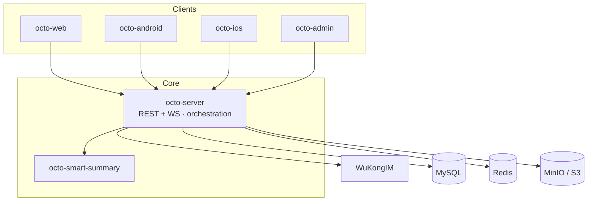

Octo 是一组职责聚焦的服务，它们汇聚于一个核心锚点：**`octo-server`**。它向客户端暴露 REST + WebSocket API，编排业务逻辑与 Lobster（AI 智能体）调度，并驱动 [WuKongIM](/zh/concepts/messaging-and-im-core) 实现实时消息。

## 服务图谱

客户端与各兄弟服务**都与 `octo-server` 通信**；只需部署并扩展这一个后端，其余一切都与它交互。存储与 IM 都是可插拔的：内置了 MySQL 兼容的迁移脚本与对象存储适配器，而 WuKongIM 通过一层薄薄的控制面边界来驱动，使 IM 核心始终可替换。

## 请求生命周期

经过 `octo-server` 的每个请求都遵循相同的路径：

<Steps>
  <Step title="认证">
    认证中间件解析凭据——一个由 Redis 缓存的令牌解析器还会解析出调用方的语言与角色。参见[安全与认证](/zh/concepts/security-and-auth)。
  </Step>
  <Step title="授权">
    Space 中间件执行组织感知的 RBAC（member / admin / owner）、按 Channel 的 ACL，以及智能体身份门控。任何触及用户数据的 handler 都必须经过它。
  </Step>
  <Step title="执行">
    运行业务逻辑——可能会启动或恢复一个 Lobster（机器人）会话。参见 [Lobster 模型](/zh/concepts/the-lobster-model)。
  </Step>
  <Step title="扇出">
    消息被入队到 WuKongIM（经由 gRPC）；若某个 Channel 需要外部桥接，则触发相应的[适配器 / Channel](/zh/guides/bot-developers/choose-a-channel)。
  </Step>
  <Step title="响应">
    返回统一的 JSON 信封（或 WebSocket 帧），带有链路追踪与指标标签，并在三层（按 IP、按端点、按 UID）进行限流。
  </Step>
</Steps>

## 服务端如何构建

`octo-server` 组织为 `modules/` 下的 **27+ 个自动注册模块**（每个模块通过 `init()` + `register.AddModule()` 自行接线），而非单一巨石。机器人身份、代理执行（on-behalf-of）编排、Space、话题以及 BotFather 各自独立成模块。

<Card title="部署整套系统" icon="rocket" href="/zh/get-started/quickstart-deploy">
  在一个 Compose 栈中看到所有服务协同运行。
</Card>
