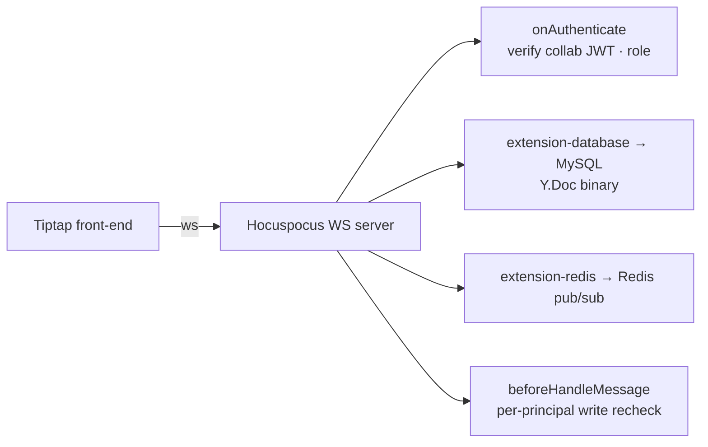

Octo Docs 提供两个互补的界面：由 CRDT 支撑的**实时协作文档**，以及从提示发布的**交互式 HTML 文档**。它们服务于不同场景——实时共同编辑 vs. 不可变、可分享的产出物。

## 实时编辑——`octo-docs-backend`

协作文档子系统是一个职责聚焦、有状态的 **CRDT 实时同步服务**，构建于 **Hocuspocus + Yjs** 之上。Tiptap 前端经由 WebSocket 连接；服务端拥有权威的持久化与授权。

关键特性：

- **CRDT 同步**——Yjs 文档无冲突地合并并发编辑。
- **权威持久化**——二进制 `Y.Doc` 存储在 MySQL 中；真相之源是服务端，而非客户端。
- **文档自治的授权**——访问按文档进行治理（`doc_member` + owner），配合短时协作令牌签发与链接邀请；每条消息都会按主体重新校验写权限。
- **智能体通路**——一条无 DOM 的转换通路让智能体无需浏览器即可读写文档。

<Note>
  该子系统的范围被严格限定在实时文档同步——它有意不覆盖白板/Excalidraw 功能。授权按文档进行，独立于频道的 ACL。
</Note>

## 交互式 HTML 文档——`octo-docs-html`

面向产出物而非实时编辑，**`octo-docs-html`** 将一段提示转化为自包含的**交互式 HTML 文档**——模型、SVG 图表、模拟、讲解、RFC——并发布在稳定的 URL 上。它与 Octo 深度集成，具备：

- **创建者拥有的访问控制**——作者掌控谁可以查看。
- **锚定的内联评论**——评审者可将评论锚定到他们正在查看的文本*或*产出物上；评论会跨版本重新锚定。
- **不可变版本化**——每次发布都是一个新的不可变版本。

HTML 文档 API 是自动生成参考的一部分——参见 [Docs（交互式 HTML）API](/zh/reference/api/html) 及其 [CLI 命令](/zh/reference/cli/html)。

<Card title="在日常中使用文档" icon="messages-square" href="/zh/guides/teams/use-chat-and-docs">
  聊天与文档如何为团队协同配合。
</Card>
