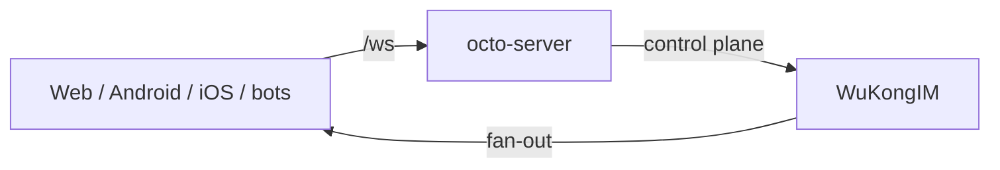

Octo 的实时消息运行在 **[WuKongIM](https://github.com/Mininglamp-OSS/octo-im)**（`octo-im`）之上——一个高性能、去中心化的即时通讯服务器。`octo-server` 通过一层薄薄的控制面边界来驱动它，使 IM 核心始终可替换，而平台则拥有业务逻辑与 Lobster 编排。

## 它位于何处

浏览器与 SPA 的聊天流量经由 nginx `/ws` 进入；`octo-server` 完成认证与授权，然后将消息入队到 WuKongIM，由后者在**基于 Channel 的发布/订阅**模型（个人、群组、客服与社区 Channel）上处理连接管理与投递。

## 协议

- 出于效率考虑采用**自定义二进制协议**（心跳包仅为单字节），并额外提供**可经 WebSocket 使用的 JSON 协议**。
- 传输：WebSocket、TLS 1.3，以及对 proxy-protocol 的支持。
- Channel type 映射到 Octo 的对话种类（私聊 = `channel_type` 1，群聊 = 2，话题 = 5——与你传给[消息 API](/zh/reference/api/message) 的取值相同）。

## 分布式设计

WuKongIM 被设计为可作为**无单点故障**的弹性集群运行：

- **存储**——构建于 PebbleDB 键值存储之上的自研分布式数据库。无第三方中间件依赖。
- **集群**——一种改进的*拉取模式*多分组 Raft，采用去中心化设计、节点间数据冗余，以及自动故障转移。
- **扩缩容**——快速的自动集群扩容与代理节点机制。

<Info>
  由于没有外部消息代理，单节点部署是真正自包含的——这也是 [Compose 栈](/zh/guides/operators/deploy-compose)能在单台主机上运行的原因之一。对于生产环境的集群，可独立于 `octo-server` 对 WuKongIM 进行扩缩容。
</Info>

## 运维界面

WuKongIM 集成了 Webhook、Datasource 钩子以及 **Prometheus** 监控。管理 API（上游默认管理端口 `5300`；在 Octo 部署中映射到 loopback）是一个管理/调试界面，而非聊天传输通道——请将其隔离于公网之外。参见[扩缩容与可观测](/zh/guides/operators/scale-and-observe)。

<Note>
  构建需要 Go 1.20+；不支持 Windows。仓库在 `cmd/` 下提供了辅助二进制：`wukongim`（服务器）、`wkbench`（基准测试）以及 `wkdb`（节点本地只读存储检查器）。
</Note>

<CardGroup cols={3}>
  <Card title="架构总览" icon="sitemap" href="/zh/concepts/architecture-overview">
    IM 内核在整个平台中的位置。
  </Card>
  <Card title="扩展与可观测" icon="chart-line" href="/zh/guides/operators/scale-and-observe">
    集群化、监控与扩展 WuKongIM。
  </Card>
  <Card title="消息 API" icon="comments" href="/zh/reference/api/message">
    传输层的消息接口。
  </Card>
</CardGroup>
