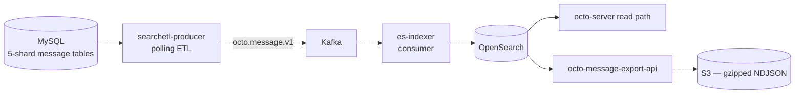

消息搜索是一条**可选启用**的流水线，与核心栈并行存在。它有清晰的分工：一个使 OpenSearch 与消息存储保持同步的*写/索引*层，以及一个用于批量拉取数据的*读/导出* API。

## 流水线

## 写 / 索引——`octo-search-indexer`

一个镜像内提供**两个解耦的二进制**：

- **`searchetl-producer`**（写侧）——一个独立的轮询式 ETL，以慢游标节拍读取 MySQL 消息分片表，将每行数据以故障即关闭的可见性富化为消息契约，并生产到 Kafka。
- **`es-indexer`**（索引侧）——一个 Kafka 消费者，幂等地批量写入 OpenSearch（`doc _id = message_id`），中文分词由索引分析器处理。

它们从不相互 import；只在 `octo-lib` 的 `contract/searchmsg` 消息契约与 Kafka 主题（`octo.message.v1` 及其 DLQ）处汇合。

<Info>
  **可靠性**——仅手动提交；偏移量只推进到连续成功的前缀。瞬时失败原地重试；永久性的“毒丸”（除 429 外的 4xx、未知 schema 版本）路由到 DLQ。被撤回 / 删除的消息在*读*时通过 `octo-server` 中的一次 MySQL join 过滤，而非在索引中处理——因此删除总是被遵守。
</Info>

一个单独的一次性 `cmd/backfill` 直接加载历史数据（绕过 Kafka），并由一次强制的字段级对账进行门控。

## 读 / 导出——`octo-message-export-api`

一个基于 OpenSearch 索引的**异步批处理** API——不存在同步通路：

<Steps>
  <Step title="提交">
    `POST /v1/messages/batch`，附带 Channel 列表 + 时间范围 → 始终返回 **HTTP 202** + 一个 `task_id`。
  </Step>
  <Step title="轮询">
    `GET /v1/messages/batch/{task_id}` 查询状态。`DELETE` 幂等地取消。
  </Step>
  <Step title="下载">
    通过预签名的 S3 兼容 URL 获取 gzip 压缩的 **NDJSON** 分片。
  </Step>
</Steps>

分页使用 OpenSearch 的 **PIT + `search_after`**（5 分钟保活）以获得稳定快照。结果写入器将 NDJSON 流式经 gzip 输出，在解压后 ≥ 500 MB 或 ≥ 30 000 行时滚动出新的分片。任务/分片元数据存于 MySQL；载荷存于 S3；服务本身则无状态。服务端保护：单任务超过 300 000 命中返回 `413`，进程内上限（v1 为 50 个任务）被超出时返回 `503`。

## 启用它

搜索默认关闭。用 `./setup.sh --search` 启动相关基础设施，然后执行零停机切换——参见[运维搜索、摘要与语音](/zh/guides/operators/subsystems)。

<Card title="逐步导出消息" icon="magnifying-glass" href="/zh/guides/integrators/export-and-search-messages">
  导出 API 的操作指南。
</Card>
