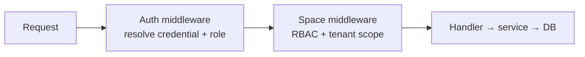

Octo 拥有一套贯穿所有服务的统一认证契约，由 **[`octo-auth`](https://github.com/Mininglamp-OSS/octo-auth)** SDK（Go + TypeScript）实现，并由 `octo-server` 提供服务。任何需要校验调用方的服务都使用同样的三个领域（realm）。

## 三种凭据领域

| 领域 | 凭据 | 校验端点 | 作用范围 |
|---|---|---|---|
| **Session** | 32 位十六进制 UUID（无前缀） | `POST /v1/auth/verify` | 人类 Web 会话 |
| **User Bot** | `bf_…` | `POST /v1/auth/verify-bot` | 私聊 + 群聊 + 话题 |
| **User API key** | `uk_…`（长度 ≥ 35） | `POST /v1/auth/verify-api-key` | 绑定到恰好一个 Space |

一个 **`MultiVerifier`** 外观按前缀分派：`uk_` → api-key，`bf_`/`app_` → bot，其余 → session。`app_`（App Bot）为保留前缀——SDK v1 对它返回 `AUTH_INVALID_CREDENTIAL`。

<Info>
  调用方可在 `verify` / `verify-api-key` 上请求 `?include=context`，从而在一次往返中获取主体的 Space 与其拥有的机器人。`verify-bot` **不**接受该参数——机器人的 `space_id` 以服务端为准，且中间件对机器人流量必须忽略任何客户端发送的 `X-Space-Id`（反伪造）。
</Info>

## RBAC 与租户

授权以 Space 为作用域。Space 成员拥有一个角色——`0` member / `1` admin / `2` owner——且每个触及用户数据的 handler 都会经过 **Space 中间件**。多租户隔离是结构性的：各服务按 `space_id`（来自 `X-Space-ID`）过滤，Bot API 在任何操作前校验机器人归属，话题模块则校验父 Channel 的访问权限。

## 反枚举

每一种“令牌无效”的原因——缺失、格式错误、未知、过期、被禁用、类型不匹配——都收敛为单一的传输层结果：**`AUTH_INVALID_CREDENTIAL`（401）**。具体原因仅存在于服务端的审计日志中；调用方不得基于任何隐含的子原因做分支判断。SDK 仅保留这个大类。

## 类型化错误

`octo-auth` 将四种传输层错误码映射为类型化、可用 `errors.Is` 比较的类别（Go）/ `OctoAuthError`（TS），并提供一个**故障即关闭（fail-closed）**的默认错误映射器：

| SDK 类别 | 传输层错误码 | HTTP |
|---|---|---|
| `ErrKindInvalidCredential` | `AUTH_INVALID_CREDENTIAL` | 401 |
| `ErrKindDisabled` | `AUTH_DISABLED` | 403 |
| `ErrKindForbidden` | `AUTH_FORBIDDEN` | 403 |
| `ErrKindInfraFailure` | `AUTH_INFRA_FAILURE` | 503 |

## 纵深防御

- **限流**——`octo-server` 中间件中的三层：按 IP 的全局限流、严格的按端点限流，以及共享的按 UID 限流。
- **静态密钥**——部署将 `.env` 保持为 `root:600`；`OCTO_MASTER_KEY` 提供静态数据的 AEAD 加密（轮换是破坏性的——请一次选定）。参见[安全加固](/zh/guides/operators/security-hardening)。

<CardGroup cols={2}>
  <Card title="在你的服务中校验凭据" icon="key" href="/zh/guides/integrators/verify-credentials-with-octo-auth">
    在你自己的中间件中使用 octo-auth SDK。
  </Card>
  <Card title="错误分类" icon="triangle-exclamation" href="/zh/reference/errors-and-envelopes">
    自动生成的传输层错误参考。
  </Card>
</CardGroup>
