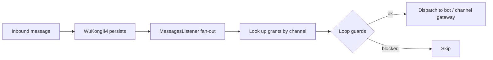

**Lobster** 是 Octo 对由 OpenClaw 驱动的数字分身的称呼——一个承担*思考*与*执行*、而把*品味*留给人类的 AI 智能体。本页解释这一理念在 `octo-server` 中究竟是如何实现的。

<Info>
  “Lobster” 是产品层面的概念。在代码中，它就是 **bot** 与 **代理执行（on-behalf-of，OBO）** 框架——机器人是一等对话参与者，而非附加的聊天机器人层。
</Info>

## 两种机器人

机器人按令牌前缀进行认证，并由统一的 `authBot()` 中间件路由：

| 类型 | 令牌 | 访问范围 |
|---|---|---|
| **User Bot** | `bf_…` | 私聊 + 群聊 + 话题（需要成员资格） |
| **App Bot** | `app_…` | 仅私聊（由服务端强制） |

创建机器人、其命令菜单及其 Skill，都由 **BotFather** 模块处理——正是你在[连接你的第一个机器人](/zh/get-started/quickstart-connect-a-bot)中使用的那套 `/newbot` 流程。

## 消息如何抵达智能体

智能体并不轮询。在 WuKongIM 持久化一条入站消息之后、*但在*副本被投递*之前*，会触发一个**扇出钩子**：

授权（grant）按 `(channel_id, channel_type)` 拉取，随后三条**防环**规则对分发进行门控：机器人绝不处理自己发送的消息，绝不对授予者自身的出站消息再次触发，并且一个已处理标记（`__obo_processed__`，一个服务端保留的专用命名空间）可防止重复处理。

## 代理执行（人格克隆）

OBO 让机器人在获得明确授权后**以某个用户人格的身份**行动。其 REST 端点挂载于 `/v1/obo` 之下、位于用户认证之后，且行动用户必须是授予者——跨用户访问会返回 `404`，作为一种枚举防御。这正是 Lobster 能在对话中代表你行动、却从不持有你会话的方式。

## 工具调用以卡片形式呈现

当智能体执行某个动作时，结果通过**交互式卡片协议**（Adaptive Cards 1.5，`octo/v1` 配置文件）呈现，使工具调用的预览与操作在客户端中原生渲染——也就是你在 [octo-web](/zh/guides/teams/use-chat-and-docs) 中看到的“内联工具调用预览”。

## 机器人令牌只留在服务端

机器人令牌从不离开 `octo-server`。浏览器只能看到一个 `bot_uid`；本地的 Agent 运行时通过其自身受限作用域的凭据来获取所需的令牌，因此该密钥从不暴露给客户端。哪些 Daemon 存活、它们承载哪些机器人，都在服务端追踪，并通过 [Agent 运行时升级流程](/zh/guides/operators/upgrades)对外呈现。

<Card title="把一个智能体接入 Octo" icon="robot" href="/zh/get-started/quickstart-connect-a-bot">
  动手实践路径：几分钟内注册一个机器人并桥接 Claude Code。
</Card>
