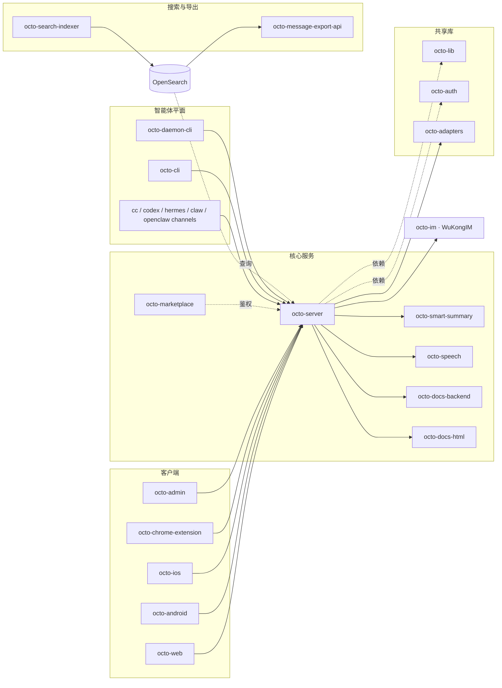

Octo 分布在 [Mininglamp-OSS](https://github.com/Mininglamp-OSS) 下一系列职责聚焦的仓库中。
本门户按*你想做什么*来组织；本页则是按*仓库*绘制的地图，面向贡献者以及任何想理清方向的人。

## 各部分如何协同

## 核心服务（Go）

| 仓库 | 职责 |
|---|---|
| [`octo-server`](https://github.com/Mininglamp-OSS/octo-server) | 后端 API · 编排 · Lobster 调度 · 驱动 WuKongIM |
| [`octo-smart-summary`](https://github.com/Mininglamp-OSS/octo-smart-summary) | LLM 会话摘要 |
| [`octo-speech`](https://github.com/Mininglamp-OSS/octo-speech) | 语音转文字微服务 |
| [`octo-search-indexer`](https://github.com/Mininglamp-OSS/octo-search-indexer) | 消息搜索写入 + 索引层 |
| [`octo-message-export-api`](https://github.com/Mininglamp-OSS/octo-message-export-api) | 异步批量消息导出 |
| [`octo-marketplace`](https://github.com/Mininglamp-OSS/octo-marketplace) | 技能 / MCP 市场控制平面（脚手架） |

## 协同文档（Go）

| 仓库 | 职责 |
|---|---|
| [`octo-docs-backend`](https://github.com/Mininglamp-OSS/octo-docs-backend) | 实时 CRDT 文档同步（Yjs + Hocuspocus） |
| [`octo-docs-html`](https://github.com/Mininglamp-OSS/octo-docs-html) | prompt 原生的交互式 HTML 文档 |

## 客户端

| 仓库 | 语言 | 职责 |
|---|---|---|
| [`octo-web`](https://github.com/Mininglamp-OSS/octo-web) | TS / React | Web 与 PC（Electron）客户端 |
| [`octo-android`](https://github.com/Mininglamp-OSS/octo-android) | Kotlin / Java | 原生 Android 客户端 |
| [`octo-ios`](https://github.com/Mininglamp-OSS/octo-ios) | Swift / Obj-C | 原生 iOS 客户端 |
| [`octo-chrome-extension`](https://github.com/Mininglamp-OSS/octo-chrome-extension) | TS / React (WXT) | 浏览器扩展 |
| [`octo-admin`](https://github.com/Mininglamp-OSS/octo-admin) | TS / React | 管理控制台 |

## IM 内核、共享库与 CLI

| 仓库 | 职责 |
|---|---|
| [`octo-im`](https://github.com/Mininglamp-OSS/octo-im) | WuKongIM——分布式消息内核 |
| [`octo-lib`](https://github.com/Mininglamp-OSS/octo-lib) | 共享 Go 库（协议、加密、存储、HTTP） |
| [`octo-auth`](https://github.com/Mininglamp-OSS/octo-auth) | 凭据校验器 SDK（Go + TS） |
| [`octo-adapters`](https://github.com/Mininglamp-OSS/octo-adapters) | 第三方 IM / AI / 数据源桥接 |
| [`octo-cli`](https://github.com/Mininglamp-OSS/octo-cli) | 面向 AI bot 的单二进制 REST 客户端（98 个操作） |
| [`octo-daemon-cli`](https://github.com/Mininglamp-OSS/octo-daemon-cli) | 每台机器的运行时监视与升级器 |

## 标准、技能与通道

| 仓库 | 职责 |
|---|---|
| [`octo-spec`](https://github.com/Mininglamp-OSS/octo-spec) | Git 原生的 AI 编码标准（OKF 格式） |
| [`octo-skills`](https://github.com/Mininglamp-OSS/octo-skills) | AgentSkills 集合 |
| [`cc-channel-octo`](https://github.com/Mininglamp-OSS/cc-channel-octo) | Claude Code → Octo 通道 |
| [`codex-channel-octo`](https://github.com/Mininglamp-OSS/codex-channel-octo) | OpenAI Codex → Octo 通道 |
| [`hermes-channel-octo`](https://github.com/Mininglamp-OSS/hermes-channel-octo) | hermes-agent → Octo 通道 |
| [`claw-channel-octo`](https://github.com/Mininglamp-OSS/claw-channel-octo) | WorkBuddy Claw → Octo 通道 |
| [`openclaw-channel-octo`](https://github.com/Mininglamp-OSS/openclaw-channel-octo) | OpenClaw → Octo 通道 |

## 交付

| 仓库 | 职责 |
|---|---|
| [`octo-deployment`](https://github.com/Mininglamp-OSS/octo-deployment) | 官方开箱即用部署（Compose + Kubernetes + Helm） |
| [`octo-website`](https://github.com/Mininglamp-OSS/octo-website) | 官方落地页 |

<Info>
  每个仓库都保留各自的深度文档；本门户聚合了横切的叙述以及
  [生成的参考文档](/zh/reference/rest-websocket-api)。每个仓库均以 **Apache-2.0** 发布
  （[以产品方式发布](/zh/concepts/design-philosophy)）。
</Info>
