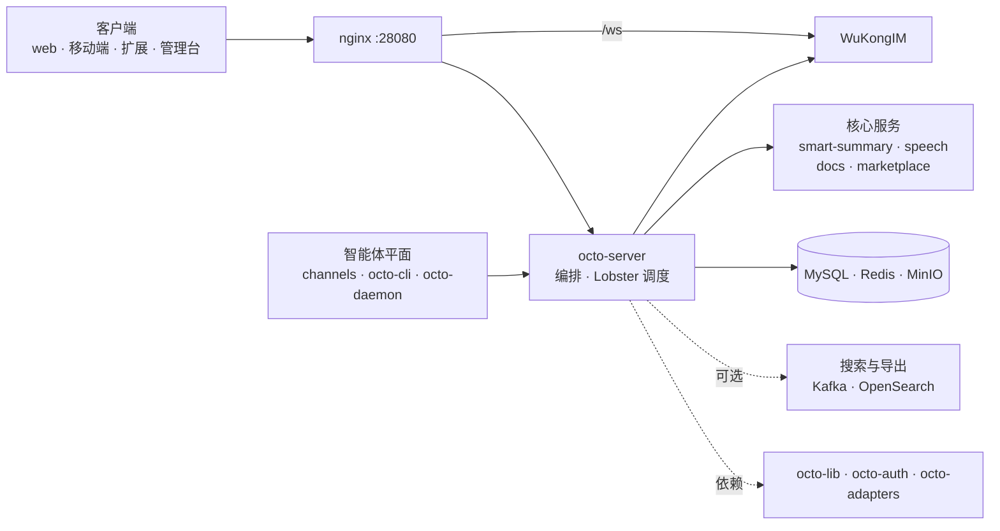

Octo 是一组职责聚焦的服务，它们汇聚于一个核心锚点——**`octo-server`**。客户端与各兄弟服务都与它通信；它编排业务逻辑与 Lobster 调度，并驱动 [WuKongIM](/zh/concepts/messaging-and-im-core) 实现实时消息。

## 请求生命周期

经过 `octo-server` 的每个请求都遵循相同的五个步骤：

<Steps>
  <Step title="认证">解析凭据（会话、`bf_` 机器人令牌或 `uk_` 密钥）。</Step>
  <Step title="授权">组织感知的 RBAC + 按频道的 ACL + 智能体身份门控。</Step>
  <Step title="执行">运行业务逻辑，可能会启动或恢复一个 Lobster 会话。</Step>
  <Step title="扇出">将消息入队到 WuKongIM；若该频道需要向外桥接，则触发相应适配器。</Step>
  <Step title="响应">返回统一的 JSON 信封（或 WS 帧），并附带链路追踪与指标。</Step>
</Steps>

## 了解更多

<CardGroup cols={2}>
  <Card title="架构总览" icon="sitemap" href="/zh/concepts/architecture-overview">
    完整的服务图谱，以及服务端的构建方式。
  </Card>
  <Card title="Lobster 模型" icon="brain" href="/zh/concepts/the-agent-model">
    智能体如何作为一等成员参与其中。
  </Card>
  <Card title="消息与 IM 核心" icon="comments" href="/zh/concepts/messaging-and-im-core">
    分布式 WuKongIM 的设计。
  </Card>
  <Card title="仓库指南" icon="diagram-project" href="/zh/ecosystem/repository-guide">
    所有仓库及其相互连接方式。
  </Card>
</CardGroup>
