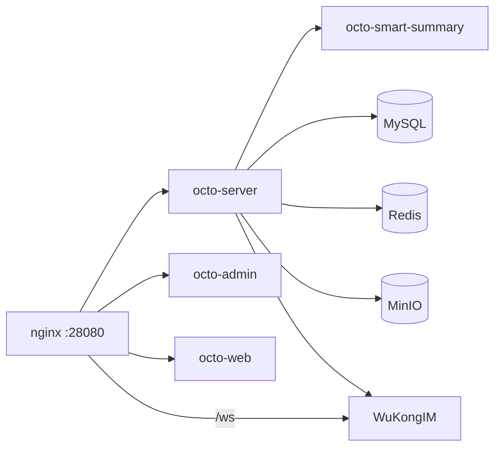

本教程带你在单台主机上从零拉起一套可用的 Octo，使用**官方开箱即用的 Docker Compose 部署**
([`octo-deployment`](https://github.com/Mininglamp-OSS/octo-deployment))。完成后，你将拥有
一套相互打通并已验证的技术栈：服务端、管理台、Web 客户端、WuKongIM 消息内核、MySQL、Redis，
以及 MinIO 对象存储。

<Tip>
  一条命令即可把整套技术栈拉起，置于 nginx 反向代理之后，仅暴露单一端口（`28080`）。其余服务
  默认全部绑定在回环地址上——这是评估与内部演示的安全姿态。
</Tip>

## 前置条件

<Info>
  开始之前，请确保你的主机已具备下列全部条件。
</Info>

- **Linux 或 macOS**，`bash` ≥ 4，并已安装 `openssl`。
- **Docker** 正在运行，且 `PATH` 上有 Compose v2 插件（`docker compose`）或独立的
  `docker-compose` 二进制。验证：
  ```bash
  docker info            # 应无需 sudo 即可成功
  docker compose version
  ```
- **≥ 4 GiB 内存** 且 **≥ 10 GiB 可用磁盘**（供命名卷使用）。
- **一个开放的 TCP 端口**供客户端流量使用：`28080`。
- 具备访问 `docker.io`（或镜像源）的**出站网络**，以拉取 `mininglamposs/*`、`mysql:8`、
  `redis:7-alpine`、`minio/minio`、`wukongim/wukongim` 与 `nginx:1.27-alpine` 镜像。

<Warning>
  **本机已经在跑 Octo？** 请在拉起之前设置唯一的 `COMPOSE_PROJECT_NAME`——两个默认克隆会
  共享命名卷，某一套执行 `docker compose down -v` 可能抹掉另一套的数据。
</Warning>

## 部署技术栈

<Steps>
  <Step title="克隆并生成配置">
    ```bash
    git clone https://github.com/Mininglamp-OSS/octo-deployment.git
    cd octo-deployment
    ./setup.sh
    ```

    `setup.sh` 以交互方式运行，会写出 `docker/.env`，其中包含新轮换的随机密钥和一个生成的
    管理员密码。它会自动探测你的公网 IP，但**默认使用 `localhost`**——按回车即保持本机可用，
    或在其它机器需要访问时输入真实的 DNS 域名 / IP。

    <Note>
      脚本化部署时可跳过交互：`./setup.sh --non-interactive --ip 1.2.3.4`。追加 `--summary`
      可启用可选的 LLM 摘要服务，`--search` 可启用消息搜索流水线。
    </Note>
  </Step>

  <Step title="拉起技术栈">
    ```bash
    sudo ./setup.sh --up
    ```

    `--up` 是一个“仅启动”子命令：它执行 `docker compose up -d --wait`，并**阻塞直到每个服务
    报告 `(healthy)`**、两个一次性初始化任务（`preflight`、`minio-init`）都干净退出。等待期间
    每 5 秒打印一个 `.`——首次启动时冷 MySQL 初始化可能耗时 60–90 秒。若某个服务启动失败，
    `--up` 会打印 `docker compose ps`、指出失败的服务，并在退出前给出 `logs` 提示。

    <Info>
      **为什么需要 sudo？** `--up` 需要访问 Docker 守护进程套接字，而 `docker/.env` 保存了整套
      技术栈的所有高价值密钥，因此保持 `root:600`。`--up` 绝不会重新生成这些密钥——它只负责启动。
    </Info>
  </Step>

  <Step title="验证部署">
    运行内置的冒烟测试，它会端到端地检验**对外**表面——而不仅仅是容器健康：

    ```bash
    sudo ./setup.sh --smoke-test
    ```

    它跨两个失败域运行 11 项探测，并逐项打印 PASS/FAIL：

    - **`[infra]`** — 容器健康、nginx 路由、`octo-server` REST、MinIO 健康，以及
      管理台 / Web 两个 SPA。
    - **`[user-path]`** — WuKongIM `/ws`、一次管理员登录（POST）、预签名 URL 签发（GET），
      以及一次向 MinIO 的签名 1 字节 PUT。

    全部 PASS 意味着鉴权与对象存储真正可用，而不只是容器起来了。
  </Step>

  <Step title="登录">
    `setup.sh` 会在运行结束时打印管理台 URL 和密码。使用默认 `localhost` 时：

    | 界面 | URL | 登录 |
    |---|---|---|
    | **管理台** | `http://localhost:28080/admin/` | 用户 `superAdmin` |
    | **Web 客户端** | `http://localhost:28080/` | — |

    打开管理台，以 `superAdmin` 和打印出的密码登录，创建你的第一个组织。

    <Note>
      若你将 `OCTO_DOMAIN` 设为真实主机名，请确保所有访问 UI 的机器都能解析该名称（真实 DNS
      或 `/etc/hosts` 条目）。
    </Note>
  </Step>
</Steps>

## 正在运行的组件

该 Compose 技术栈将以下组件串联起来：



所有客户端流量经 nginx 从 `28080` 进入；每个后端服务（MySQL、Redis、MinIO、WuKongIM 管理
API）都绑定在回环地址上。

## 下一步

<CardGroup cols={2}>
  <Card title="接入你的第一个 AI 机器人" icon="robot" href="/zh/get-started/quickstart-connect-a-bot">
    Octo 的招牌路径：把 Claude Code 桥接进你刚部署的实例。
  </Card>
  <Card title="为你的组织完成上手" icon="users" href="/zh/guides/teams/onboard-your-org">
    邀请成员并配置频道。
  </Card>
  <Card title="在 Kubernetes 上部署" icon="dharmachakra" href="/zh/guides/operators/deploy-kubernetes">
    当单台主机不再够用时。
  </Card>
  <Card title="配置参考" icon="sliders" href="/zh/reference/configuration">
    每一个服务端配置项及其默认值。
  </Card>
</CardGroup>

<Tip>
  移除整套技术栈（交互式）：`sudo ./setup.sh --uninstall`。
</Tip>
