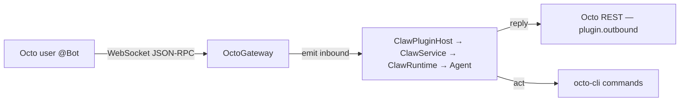

有两个频道封装了 OpenClaw 家族。二者都通过 WebSocket 连接，并让智能体在 Octo 上行动。

## openclaw-channel-octo

**[`openclaw-channel-octo`](https://github.com/Mininglamp-OSS/openclaw-channel-octo)** 是
OpenClaw 频道插件，仅在 ClawHub 上独家发布。

```bash
openclaw plugins install clawhub:octo
openclaw channels add --channel octo \
  --account my_bot \
  --bot-token bf_your_token_here \
  --http-url https://your-server.example/api
openclaw gateway run --force
```

需要 Node ≥ 22 以及 OpenClaw ≥ 2026.4.15。账号配置位于 `~/.openclaw/openclaw.json`
中的 `channels.octo.accounts` 下，并支持热重载。令牌可以是 `bf_`（User Bot，完整群组 +
话题）或 `app_`（App Bot，仅私聊）。

<Info>
  该插件注册了一个智能体工具，**`octo_management`**（群组、`GROUP.md`/`THREAD.md`、
  话题、成员、`write-secret`）。它仅在 `tools.profile: full` 下才被准入；全新
  安装默认使用 `coding` 配置，因此需通过 `tools.alsoAllow` 添加它。
</Info>

生命周期：REST 注册机器人 → WebSocket 连接 → 自动重连 → 向拥有者问候 →
分发，并带有正在输入指示、已读回执，以及进度 / 展示卡片。

## claw-channel-octo

**[`claw-channel-octo`](https://github.com/Mininglamp-OSS/claw-channel-octo)** 是内置的
WorkBuddy Claw 频道插件——它让 Octo IM 成为一个 WorkBuddy 远程控制频道，与
WeCom / Feishu / DingTalk 并列。它是一种双系统设计：



- **OctoGateway**（“耳朵”）——一个持久的 WebSocket（JSON-RPC over WS），负责接收入站
  消息并把它们发送给 Claw 运行时。
- **octo-cli**（“手”）——智能体通过
  [`octo-cli`](/zh/guides/bot-developers/drive-octo-with-cli) 命令主动操作 Octo。

在 `connectionMode: "websocket"` 下，回复直接经由 `plugin.outbound` / Octo REST 发出——
而非经过外部 webhook 中继。功能：私聊 / 群组 / 话题、文本 / 图片 / 文件、文件
上传、流式回复（send → edit → final）、自动重连、30 秒心跳，以及 5 分钟
去重。阶段 1–2 已完成；设置面板 UI（阶段 3）待定。

<Card title="对比所有频道" icon="code-compare" href="/zh/guides/bot-developers/choose-a-channel">
  看看 OpenClaw 和 Claw 相对于其他频道处于什么位置。
</Card>
