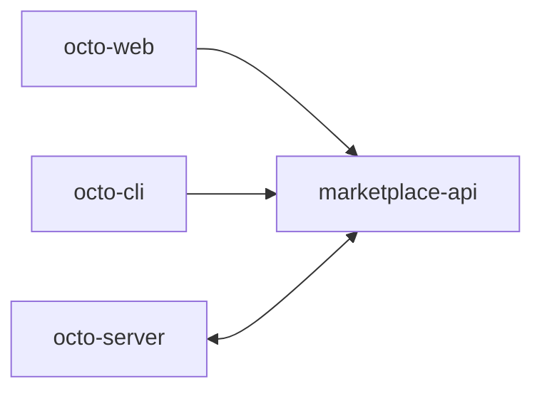

**[`octo-marketplace`](https://github.com/Mininglamp-OSS/octo-marketplace)** 是未来 Octo
**Skill 与 MCP 应用市场** 的控制平面——一个用于发布、版本化和分发
[Skills](/zh/guides/bot-developers/publish-a-skill) 与 MCP 服务器的地方。

<Warning>
  **脚手架状态。** 该服务是一个早期的 Go 脚手架。控制平面的*形态*已经就位——
  健康/就绪、配置、Octo auth 客户端、Skill CRUD/上传/解析，以及 Local/OSS
  下载——但目录、发布、版本化、MCP 业务 API 和持久化都被**推迟**。
  请把本页当作发布功能未来所在之处的预览。
</Warning>

## 它位于何处



职责划分得很清晰：

- **`octo-server`** 拥有身份（它认证用户和 `bf_` 机器人）。
- **`octo-marketplace`** 拥有资产、发布和策略。
- **`octo-cli`** 拥有消费方一侧的本地安装。

## 运行脚手架

```bash
go run ./cmd/marketplace-api      # port 8092
# or
docker compose up --build         # MySQL on 3306
```

它使用 Go 1.25 + Gin + MySQL，并遵循
[`octo-smart-summary`](/zh/ecosystem/repository-guide) 的 API 服务形态。认证是统一的用户 + `bf_` User Bot，
失败即拒绝（`AUTH_ENABLED` 默认为 true），通过 Octo auth 客户端实现。当挂载于
web 网关之后时，它服务于 `/market/api/v1`。

<Card title="今天就编写一个 Skill" icon="puzzle" href="/zh/guides/bot-developers/publish-a-skill">
  技能现在就可以通过 git 原生的安装路径使用——应用市场将在此之上加入发现能力。
</Card>
