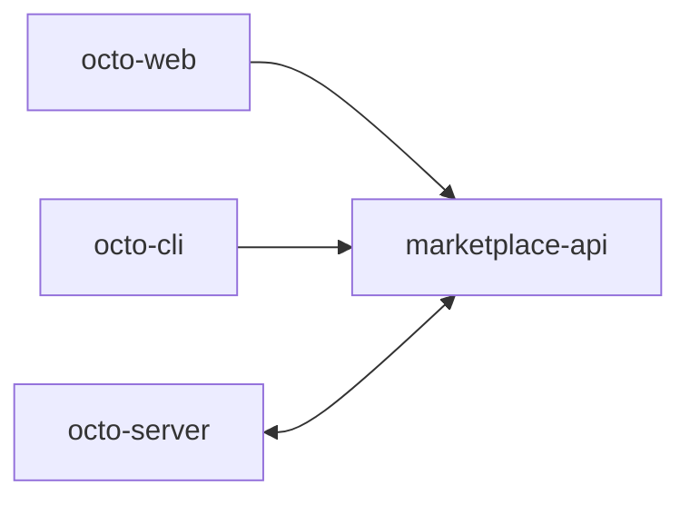

**[`octo-marketplace`](https://github.com/Mininglamp-OSS/octo-marketplace)** 是未来 Octo
**Skill 与 MCP 应用市场** 的控制平面——一个用于发布、版本化和分发
[Skills](/zh/guides/bot-developers/publish-a-skill) 与 MCP 服务器的地方。

<Warning>
  **逐步成熟的服务。** Skill 生命周期(上传 / 解析 / 创建 / 版本 / 下载、分类、标签)与
  MCP 目录(CRUD、探测、图标、分类)已在当前规范与代码中实现。目录发现 UI、发布/版本化的
  细节完善,以及完整的数据库持久化仍在接入中——请将生产使用视为尚处早期。
</Warning>

## 它位于何处



职责划分得很清晰：

- **`octo-server`** 拥有身份（它认证用户和 `bf_` 机器人）。
- **`octo-marketplace`** 拥有资产、发布和策略。
- **`octo-cli`** 拥有消费方一侧的本地安装。

## 运行脚手架

```bash
go run ./cmd/marketplace-api      # port 8092
# or
docker compose up --build         # MySQL on 3306
```

它使用 Go 1.25 + Gin + MySQL，并遵循
[`octo-smart-summary`](/zh/ecosystem/repository-guide) 的 API 服务形态。认证是统一的用户 + `bf_` User Bot，
失败即拒绝（`AUTH_ENABLED` 默认为 true），通过 Octo auth 客户端实现。当挂载于
web 网关之后时，它服务于 `/market/api/v1`。

<Card title="今天就编写一个 Skill" icon="puzzle" href="/zh/guides/bot-developers/publish-a-skill">
  技能现在就可以通过 git 原生的安装路径使用——应用市场将在此之上加入发现能力。
</Card>
