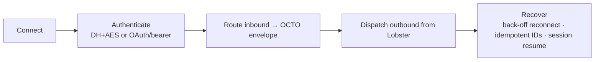

**适配器（adapter）**把一个外部系统——聊天技术栈、AI 提供方、数据源——桥接进
Octo，使其成为一个可被 Lobster 寻址的界面。适配器存放于
**[`octo-adapters`](https://github.com/Mininglamp-OSS/octo-adapters)**。每一个都是
自包含的、可以独立启用/停用，并在启动时从 `octo-server` 的配置中加载——**插入，而非打补丁**；你永远不用 fork 核心。

<Info>
  [频道](/zh/guides/bot-developers/choose-a-channel)是一种专门封装了*智能体运行时*的适配器。如果你要把一个编码智能体引入 Octo，请从频道开始。当你要桥接一个新的*外部系统*或协议时，才编写适配器。
</Info>

## 每个适配器都要实现的那一套生命周期



无论它所讲的外部协议是什么，每个适配器都暴露**同一套 OCTO 内部信封**——频道 id + 消息 + 智能体上下文。正是这种一致性，让 `octo-server` 能够以完全相同的方式路由到任意适配器。

## 天生多语言

适配器以 **TypeScript（Node）** 和 **Python** 并肩运行。该仓库随附三个
可供你复制的参考家族：

| 适配器 | 语言 | 亮点 |
|---|---|---|
| Claude Agent SDK 网关 | TypeScript | WS 网关、DH 密钥交换、AES-CBC 分帧、流式、私信 + 群组、会话持久化 |
| OpenClaw 频道 | TypeScript | OCTO IM WS、流式、正在输入、已读回执、多账号 |
| Hermes Agent 频道 | Python | hermes-agent 桥接 |

## 在本地运行一个

```bash
# Node adapter
pnpm --filter <adapter> dev

# Python adapter
pip install -e . && python -m <module>.cli
```

在 `octo-server` 的适配器配置中注册它，即可在启动时被加载。共享的基础组件
（协议、加密、存储、HTTP 辅助）来自
[`octo-lib`](/zh/ecosystem/repository-guide)，因此适配器保持轻薄。

<Card title="校验入站凭据" icon="key" href="/zh/guides/integrators/verify-credentials-with-octo-auth">
  在你适配器的 Authenticate 步骤中使用 octo-auth。
</Card>
