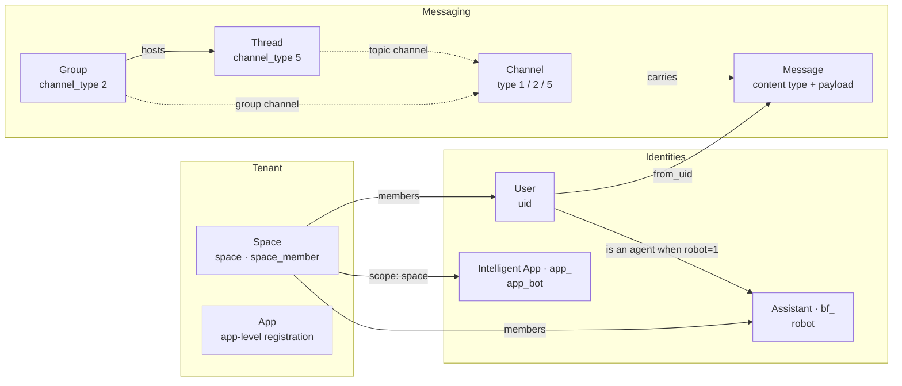

Octo 的实体由 **[`octo-server`](https://github.com/Mininglamp-OSS/octo-server)**（基于
[WuKongIM](/zh/concepts/messaging-and-im-core) 的 Go 服务）所拥有，共享类型与枚举位于
**[`octo-lib`](https://github.com/Mininglamp-OSS/octo-lib)**。持久化记录存入 MySQL，每张表都内嵌一个
基础模型——`id`、`created_at`、`updated_at`(`octo-lib/pkg/db`)。[octo-cli OpenAPI
规范](/zh/reference/rest-websocket-api)是对外契约,固定了下文用到的线级枚举取值。

<Info>
  本页把[概念页面](/zh/concepts/architecture-overview)中以散文形式描述的实体模型汇总到一处。字段与枚举细节
  以所引用的源码文件为准;如有疑问,以源码为权威。
</Info>

## 实体关系图

智能体是用户的一种特化,而非独立的身份层。Channel 是 WuKongIM 概念,以一个 id 加一个 `channel_type` 标识;
群组与话题分别映射到频道类型 2 和 5。

## Space

租户边界——它拥有频道、成员与数据。定义于 `octo-server/modules/space/model.go`(`space` 与
`space_member` 表)。

| 属性 | 含义 |
|---|---|
| `space_id` | 租户标识。 |
| `name` · `description` · `logo` | 展示元数据。 |
| `creator` | 创建该空间的 owner 的 `uid`。 |
| `max_users` | 成员上限(`0` = 无限制)。 |
| `join_mode` | 成员加入方式(见枚举)。 |
| `status` | 生命周期状态(见枚举)。 |

| 枚举 | 取值 |
|---|---|
| `join_mode` | `0` 直接加入 · `1` 需要审批 |
| `status` | `0` 已解散 · `1` 正常 · `2` 已封禁 |
| 成员 `role`(`space_member`) | `0` 普通成员 · `1` 管理员 · `2` 拥有者 |

成员记录在 `space_member` 中(`space_id` + `uid`、一个 `role`,以及 `status`:`1` 正常 / `0` 已移除)。
邮件邀请与加入申请在同一模块中一并建模。

## User

规范化的身份。`uid` 是被空间成员、群成员、消息发送者与智能体所引用的通用键。定义于
`octo-server/modules/user/db.go`(`user` 表)。

| 属性 | 含义 |
|---|---|
| `uid` | 通用身份键。 |
| `name` · `username` · `email` · `phone` | 资料与登录标识。 |
| `category` | 账号类别(见枚举)。 |
| `status` | 启用/禁用(见枚举)。 |
| `role` | 系统角色字符串(见枚举)。 |
| `robot` | 当该用户为智能体时为 `1`。 |
| `is_destroy` | 账号注销生命周期(见枚举)。 |
| `language` | 首选界面语言。 |

| 枚举 | 取值 |
|---|---|
| `status` | `0` 禁用 · `1` 启用 |
| `is_destroy` | `0` 正常 · `1` 注销申请中(冷静期) · `2` 已注销 |
| `category` | `customerService` · `system` |
| `role` | `admin` · `superAdmin` · `""`(普通用户) |

枚举来源:`octo-server/modules/user/const.go` 与 `db.go`。`role` 列是 RBAC 的权威系统角色——参见
[安全与认证模型](/zh/concepts/security-and-auth)。

## 智能体

**智能体（Agent）**是一个用户(`robot=1`),由两类携带凭证的记录之一作为前端。身份解析按**令牌前缀**路由
(`app_*` → 智能应用,`bf_*` → 助理),位于 `octo-server/modules/botidentity`。

### 助理（Assistant，`bf_`）

`robot` 表(`octo-server/modules/robot` + `botfather`)。通过 **BotFather** 聊天命令创建与管理
(`/newbot`、`/token`、`/revoke`)。可参与**私聊、群聊与话题**频道(需具备成员身份)。

| 属性 | 含义 |
|---|---|
| `robot_id` · `username` | 智能体身份(`username` 以 `_bot` 结尾)。 |
| `token` / `bot_token` | 凭证(`bf_…`)。 |
| `creator_uid` | 归属用户。 |
| `bot_commands` | 声明的命令菜单(JSON)。 |
| `access_mode` | `0` 审批 · `1` 自动 · `2` 禁止。 |
| `agent_platform` · `agent_version` · `plugin_version` | 其桥接的运行时。 |

长期有效的用户 API 密钥(`uk_`)在同一模块中一并签发。

### 智能应用（Intelligent Application，`app_`）

`app_bot` 表(`octo-server/modules/app_bot`)。**仅私聊**,且需要好友关系。

| 属性 | 含义 |
|---|---|
| `uid` | 智能应用身份(`app_…`)。 |
| `display_name` · `description` · `avatar` | 展示信息。 |
| `token` | 凭证(`app_…`)。 |
| `scope` | `platform`(全局) · `space`(单个空间)。 |
| `status` | `0` 草稿 · `1` 已发布 · `2` 已下架。 |
| `welcome_msg` | 首次接触消息。 |

### 专家（Expert）

**专家（Expert）**是一种特化的智能体——为特定领域或任务定制的助理（拥有自己的指令、Skill 与工具）。它是**产品层面的特化，而非独立的存储表**：在传输层上，专家就是一个助理（`bf_…`，即上面的 `robot` 记录）。

## Channel

一个**由 WuKongIM 拥有**的逻辑实体——octo-server 中并没有单一的频道行。频道就是一个 id 加一个
`channel_type`;每个频道的选项存于 `channel_setting` 侧表(`octo-server/modules/channel`)。完整的类型枚举
定义于 `octo-lib/common/constant.go`:

| `channel_type` | 含义 |
|---|---|
| `0` | 无 |
| `1` | 个人(**私聊**) |
| `2` | 群聊 |
| `3` | 客服 |
| `4` | 社区 |
| `5` | 社区话题(**话题**) |
| `6` | 资讯 |

<Note>
  REST API 契约使用处于活跃使用中的三种类型——**`1` = 私聊、`2` = 群聊、`5` = 话题**
  (`octo-cli/internal/registry/specs/message.json`)。私聊频道 id 为组合形式(`fromUID@toUID`)。
</Note>

## Message

存储于**分片**表中(`message`、`message1..N`,按频道 id 的哈希选择)——
`octo-server/modules/message/db.go`。一条消息携带 `from_uid`、`channel_id` + `channel_type`、一个
`message_seq`、一个时间戳,以及一个不透明的 `payload`,其 JSON `type` 字段即取自
`octo-lib/common/msg.go` 的内容类型:

| 内容类型 | 取值 |
|---|---|
| 文本 | `1` |
| 图片 | `2` |
| GIF | `3` |
| 语音 | `4` |
| 视频 | `5` |
| 位置 | `6` |
| 名片 | `7` |
| 文件 | `8` |
| 合并转发 | `11` |
| 矢量表情 | `12` |
| Emoji 表情 | `13` |
| 富文本 | `14` |
| 邀请加入组织 | `16` |
| CMD(命令) | `99` |
| Tip(提醒) | `2000` |

系统通知占用另一段取值区间——例如 `FriendApply` `1000`、`GroupCreate` `1001`、`GroupMemberAdd`
`1002`、`RevokeMessage` `1006`、`GroupUpgrade` `1022`,以及话题创建通知 `1100`。表态、置顶、提醒与已读
状态记录在同一模块的卫星表中。载荷如何被索引,参见[搜索与导出流水线](/zh/concepts/search-and-export-pipeline)。

## Thread

群组下的一个对话话题——`octo-server/modules/thread`(`thread` 表)。其频道 id 为组合形式
(`groupNo` + `____` + `shortID`),并映射到 `channel_type=5`。

| 属性 | 含义 |
|---|---|
| `short_id` · `group_no` | 话题 id 与父群组。 |
| `name` · `creator_uid` | 标题与拥有者。 |
| `source_message_id` | 话题所由来的消息。 |
| `status` | 生命周期(见枚举)。 |
| `message_count` · `last_message_at` | 活跃度概要。 |
| `thread_md` | 可选的协作笔记(带版本)。 |

| 枚举 | 取值 |
|---|---|
| `status` | `1` 活跃 · `2` 已归档 · `3` 已删除 |
| 成员 `role` | `0` 普通成员 · `1` 创建者 |

## 支撑实体

<AccordionGroup>
  <Accordion title="Group — octo-server/modules/group">
    支撑 `channel_type=2`,并承载话题。枚举(`group/const.go`):status `0` 已禁用 / `1` 正常 / `2`
    解散;成员 role `0` 普通成员 / `1` 创建者 / `2` 管理者;群类型 `0` 普通群 / `1` 超大群。成员
    `status` 为 `1` 正常 / `2` 黑名单。
  </Accordion>
  <Accordion title="Integration 与 incoming webhook — octo-server/modules/integration, incomingwebhook">
    外部连接器以 OIDC principal + `uk_` API 密钥进行认证(`integration`),而入站 webhook 则以带
    `iwh_` 前缀的合成发送者身份投递(`incomingwebhook`)。这就是外部系统在不作为完整智能体的情况下
    向频道发送消息的方式。
  </Accordion>
  <Accordion title="App — octo-server/modules/base/app">
    一个底层的多租户注册(`app_id`、`app_key`、`app_name`、`status`)。它支撑 app 级身份;面向客户的
    租户边界是上文的 **Space**。
  </Accordion>
</AccordionGroup>

## 横切枚举

### 凭证前缀

每种凭证都可由其前缀识别——正是 [octo-auth 校验器](/zh/reference/auth-verify-api)所依据分发的那一组:

| 前缀 | 凭证 |
|---|---|
| `bf_` | 助理令牌 |
| `app_` | 智能应用令牌 |
| `uk_` | 长期有效的用户 API 密钥 |
| `iwh_` | 入站 webhook 发送者 |

完整的校验语义见[安全与认证模型](/zh/concepts/security-and-auth)。

### 操作风险级别

每个 REST 操作在 OpenAPI 规范中都标注了一个 `x-octo-risk` 级别,并呈现在各
[API 领域页面](/zh/reference/rest-websocket-api)上:

| 风险 | 含义 |
|---|---|
| `read` | 非变更。 |
| `write` | 变更。 |
| `high-risk-write` | 破坏性或影响面广;需格外谨慎。 |

## 并非数据实体

文档中随处可见的两个概念**并不**以 schema 持久化——不要去找对应的表:

<Columns cols={2}>
  <Card title="Skill" icon="puzzle-piece" href="/zh/guides/bot-developers/publish-a-skill">
    一种打包的 Markdown 能力(一个 `SKILL.md` 目录),由智能体加载——它存在于 `openclaw-channel-octo`、
    `octo-skills` 等仓库中,而非数据库里。
  </Card>
  <Card title="Adapter" icon="plug" href="/zh/guides/integrators/write-an-adapter">
    一座运行时桥梁/代理(以及客户端插件)——是行为,而非存储的记录。确实会持久化状态的连接器,是上文的
    integration 与 webhook 模型。
  </Card>
</Columns>

## 后续步骤

<CardGroup cols={3}>
  <Card title="安全与认证模型" icon="shield-halved" href="/zh/concepts/security-and-auth">
    凭证、角色与租户是如何被强制实施的。
  </Card>
  <Card title="REST 与 WebSocket API" icon="code" href="/zh/reference/rest-websocket-api">
    读写这些实体的各项操作。
  </Card>
  <Card title="消息与 IM 核心" icon="comments" href="/zh/concepts/messaging-and-im-core">
    频道与消息如何流经 WuKongIM。
  </Card>
</CardGroup>
